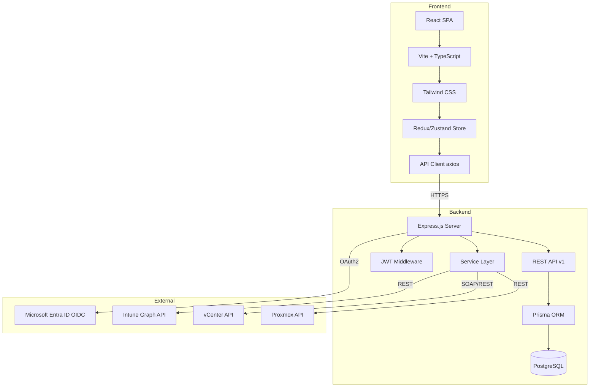
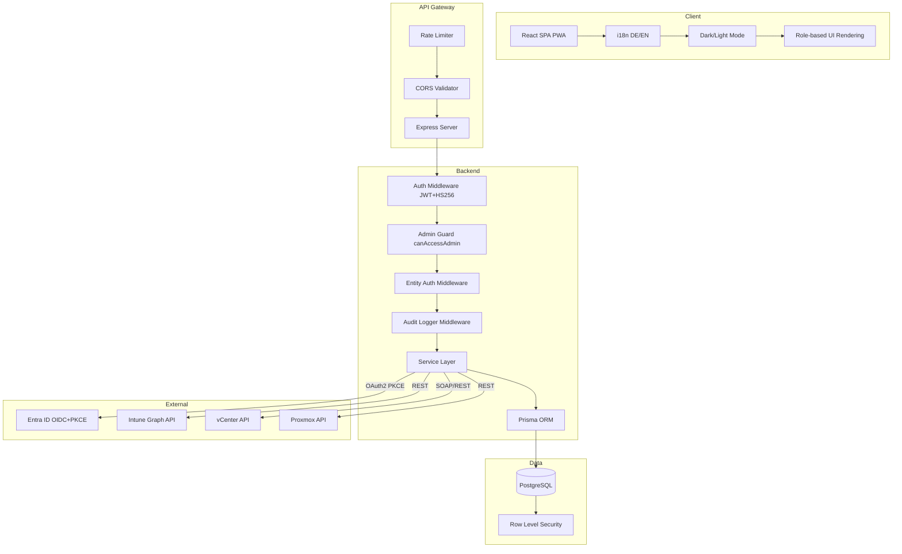
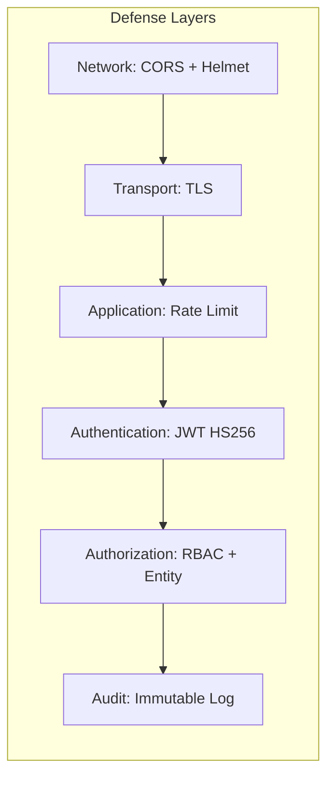

# Architektur – Asset Management System (ISO 27001)

**Version:** 1.0  
**Datum:** 2026-07-17  

---

## 1. Ist-Architektur

### 1.1 Gesamtübersicht



### 1.2 Backend-Struktur

```
backend/src/
├── index.ts                  # Express App Entry Point
├── config/
│   └── database.ts           # Prisma Client Instance
├── middleware/
│   ├── auth.ts               # JWT Auth + Role Authorization
│   ├── errorHandler.ts       # Global Error Handler (AppError)
│   └── requestLogger.ts      # HTTP Request Logging
├── routes/                   # Express Router Definitions
│   ├── admin.routes.ts       # User/Role/Group/OIDC/AssetType CRUD
│   ├── asset.routes.ts       # Asset CRUD + Graph + Relations
│   ├── auditLog.routes.ts    # Audit Log (Stub)
│   ├── auth.routes.ts        # Login/Register/OIDC/Refresh
│   ├── businessprocess.routes.ts
│   ├── contract.routes.ts
│   ├── control.routes.ts
│   ├── incident.routes.ts
│   ├── intune.routes.ts      # Intune Credential Management
│   ├── license.routes.ts
│   ├── organization.routes.ts
│   ├── proxmox.routes.ts     # Proxmox Server/Credential CRUD
│   ├── risk.routes.ts        # Risk CRUD + Treatment
│   ├── riskmethod.routes.ts  # Risk Method CRUD
│   ├── risktreatment.routes.ts
│   ├── user.routes.ts
│   └── vmware.routes.ts      # vCenter Server/Credential CRUD
├── services/                 # Business Logic Layer
│   ├── admin.service.ts      # User/Role/Group Management
│   ├── asset.graph.ts        # Graph Traversal Service
│   ├── asset.service.ts      # Asset CRUD + Relations
│   ├── auth.service.ts       # Login/Register/Token Generation
│   ├── businessprocess.service.ts
│   ├── contract.service.ts
│   ├── control.service.ts
│   ├── incident.service.ts
│   ├── intune.auth.ts        # Intune Token Management
│   ├── intune.client.ts      # Graph API Client
│   ├── intune.config.ts      # Sync Configuration
│   ├── intune.scheduler.ts   # Background Sync Scheduler
│   ├── intune.service.ts     # Device/App Sync Logic
│   ├── license.service.ts
│   ├── oidc.service.ts       # OIDC Flow (Entra ID)
│   ├── proxmox.credential.ts
│   ├── proxmox.service.ts    # Proxmox VM Import
│   ├── risk.aggregation.ts   # Risk Aggregation Logic
│   ├── risk.service.ts       # Risk CRUD
│   ├── riskmethod.service.ts
│   ├── risktreatment.service.ts
│   ├── vcenter.service.ts    # vCenter VM Import
│   └── vmware.credential.ts
├── test/                     # Test Infrastructure
│   ├── fixtures.ts           # Test Data Fixtures
│   ├── prisma-mock.ts        # Prisma Client Mock
│   └── setup.ts              # Jest Setup
└── __tests__/                # Unit/Integration Tests
```

### 1.3 Phase-1 Authorization Boundary

Phase 1 centralizes authorization in `backend/src/services/authorization.service.ts`. Routes must not rely on `authenticate` alone for business objects. The service exposes `can`, `canForEntity`, `buildReadFilter`, `require`, and `requireForEntity`; route middleware is a thin adapter around those calls.

The authorization data model is now relational: `Permission` defines the granular permission catalog, `RolePermission` connects roles to permissions, and direct/group role assignments carry optional `LegalEntity`, `OrganizationUnit`, `IsmsScope`, and `Site` constraints. Scoped checks resolve through domain relations (for example Risk → OrganizationUnit → LegalEntity → IsmsScope membership) instead of comparing unrelated IDs.

List and search endpoints merge the authorization filter into the Prisma `where` used for both result rows and counts, preventing pagination/count side channels. Detail endpoints outside scope return `403` consistently.

### 1.3 Datenmodell (Prisma)

Das Schema umfasst **40+ Modelle** in folgenden Bereichen. Der aktuelle Risiko-/Kontroll- und Asset-Inventory-Stand ist normalisiert und trennt Katalog-, Implementierungs-, Bewertungs- und Nachweisobjekte.

| Bereich | Modelle |
|---------|---------|
| Identität | User, UserRole, Role, Group, UserGroup, GroupRole, OidcConfig, Session, RefreshToken |
| Organisation | OrganizationUnit, Site |
| ISMS Core | IsmsScope, InterestedParty, StatementOfApplicability, Framework |
| Assets | AssetType, AssetSubtype, Asset, NetworkAddress, AssetRelation, AssetDocument, AssetLifecycleLog |
| Risiken | RiskMethod, RiskMethodVersion, Risk, RiskAssessment, RiskAssessmentVersion, RiskControl, RiskControlAssessment, RiskTreatment, TreatmentAction, RiskAcceptance, Threat, Vulnerability, RiskAsset, RiskEvidence |
| Controls | Requirement, Control, ControlImplementation, ControlImplementationRequirement, ControlTest |
| Incidents | Incident, IncidentAssessment, NotificationDeadline, IncidentAsset |
| Dokumente | Document, PolicyDocument, DocumentVersion, Evidence, EvidenceLink |
| Lieferanten | Supplier |
| BIA/Workflow | BusinessImpactAnalysis, BusinessProcess, Workflow, WorkflowInstance |
| Audit/Management | AuditLog, Audit, AuditFinding, CorrectiveAction, Training, ManagementReview |
| NIS2 | Nis2Assessment, Nis2Registration |
| Verträge/Lizenzen | Contract, License |
| Integrationen | IntuneDeviceSync, IntuneDetectedApp, IntuneSyncStatus, IntuneSyncConfig, IntuneAppCredentials |
| VMware | VmwareCredential, VCenterServer |
| Proxmox | ProxmoxCredential, ProxmoxServer |

### 1.4 Frontend-Struktur

```
frontend/src/
├── main.tsx                  # React Entry Point
├── App.tsx                   # Root Component + Routing
├── index.css                 # Global Styles (Tailwind)
├── components/               # Wiederverwendbare UI-Komponenten
│   ├── AssetGraph.tsx        # Graph Visualisierung
│   ├── AssetImpactAnalysis.tsx
│   ├── EntitySearchSelect.tsx
│   ├── Layout.tsx            # App Shell
│   └── Modal.tsx
├── context/                  # React Context Provider
│   ├── DarkModeContext.tsx
│   └── I18nContext.tsx
├── locales/                  # i18n Translation Files
│   ├── de.json
│   └── en.json
├── pages/                    # Route-seitige Komponenten
│   ├── Admin*.tsx            # 7 Admin-Seiten (Users, Roles, Groups, OIDC, Intune, VMware, Proxmox)
│   ├── Assets.tsx
│   ├── Contracts.tsx
│   ├── Controls.tsx
│   ├── Dashboard.tsx
│   ├── Incidents.tsx
│   ├── Licenses.tsx
│   ├── Login.tsx
│   ├── Processes.tsx
│   ├── RiskAggregation.tsx
│   ├── Risks.tsx
│   └── Settings.tsx
├── services/
│   └── api.ts               # Axios API Client + Typed Endpoints
└── store/
    └── auth.ts              # Auth State Management
```

### 1.5 Shared Types

```

### 1.6 Normalisiertes Risiko-/Kontroll-/Asset-Modell

- Requirements werden Framework-Versionen zugeordnet; Controls sind abstrakte Katalog-Controls und werden über ControlImplementation je Scope, Organisationseinheit oder Standort konkret umgesetzt.
- RiskControl ist die kanonische Verknüpfung zwischen Risk und ControlImplementation. Es ersetzt direkte Risk-Control-Arrays und enthält Rolle, Minderungsdimension, Key-Control-Flag und Status.
- RiskControlAssessment bewertet einen RiskControl-Link gegen eine RiskAssessmentVersion. Geschlossene Assessment-Versionen sind unveränderlich; neue Bewertungen werden versioniert angelegt.
- RiskAssessmentVersion speichert aktuelle, inhärente und Zielbewertungen inklusive Methodenversion, Score, Status und Closed-State. Risikoreduktionen werden nicht mehr implizit aus Controls abgeleitet, sondern als Assessor-Eingabe und Assessment-Historie geführt.
- RiskTreatment nutzt TreatmentAction für Aktionen wie create, extend, replace und improve; Actions können optional auf ControlImplementation verweisen und werden beim Abschluss nachvollziehbar aktualisiert.
- ControlTest dokumentiert Tests auf ControlImplementation-Ebene und verknüpft Nachweise generisch über EvidenceLink.
- EvidenceLink ist der generische Nachweisanker für Control, Risk, Asset, SoAItem, Document, RiskControlAssessment und ControlTest. Alte Mirror-Arrays für Risiko-/Control-/Evidence-Bezüge sind nicht mehr API-Eingabe.
- AssetType kann Inventarnummern zentral konfigurieren; AssetSubtype kann diese Konfiguration überschreiben. Asset.inventoryNumber ist global eindeutig und wird transaktional aus dem Typ-/Subtype-Pattern mit Next-Sequence vergeben oder als manuelle Nummer geprüft.

### 1.7 Entfernte oder abgewiesene Legacy-Felder

- Risk.existingControls, Risk.controls, Risk.controlIds und direkte Control-Risk-Payloads werden abgewiesen; Clients müssen RiskControl mit controlImplementationId verwenden.
- Control.relatedRiskIds, SoAItem.riskIds, SoAItem.evidenceIds und vergleichbare SoA/Evidence-Mirror-Arrays werden als Eingabe abgewiesen; Clients müssen ControlImplementation-, RiskControl- und EvidenceLink-Ressourcen verwenden.
- Evidence.relatedControlIds und Evidence.relatedRiskIds sind nicht mehr der kanonische Speicherort; EvidenceInput verwendet links[] mit entityType/entityId.
- Asset.networkAddresses als kommagetrennter String wurde durch das normalisierte NetworkAddress-Modell ersetzt.
shared/src/types/
├── asset.ts       # AssetType, AssetRelationType enums, interfaces
├── common.ts      # Common types (PaginatedResponse, etc.)
├── control.ts     # Control interfaces
├── incident.ts    # Incident interfaces
├── organization.ts # OrganizationUnit interfaces
├── risk.ts        # Risk status, treatment enums
└── user.ts        # User, Role interfaces
```

---

## 2. Identifizierte Schwachstellen und Inkonsistenzen

### 2.1 Sicherheitslücken (P0)

| # | Schwachstelle | Datei | Zeile | Beschreibung |
|---|--------------|-------|-------|-------------|
| S-01 | Hardcoded JWT Secret Fallback | [`auth.ts`](backend/src/middleware/auth.ts:23) | 23 | `process.env.JWT_SECRET \|\| 'secret'` – Default ist unsicher |
| S-02 | Hardcoded JWT Secret Fallback | [`auth.service.ts`](backend/src/services/auth.service.ts:282) | 282 | Zweiter, anderer Default-Secret |
| S-03 | Kein Algorithmus-Whitelist | [`auth.ts`](backend/src/middleware/auth.ts:23) | 23 | `jwt.verify()` ohne `algorithms` Option – anfällig für Algorithm-Swapping |
| S-04 | OIDC State nicht validiert | [`oidc.service.ts`](backend/src/services/oidc.service.ts:104) | 104 | `_state` Parameter wird ignoriert |
| S-05 | Kein PKCE | [`oidc.service.ts`](backend/src/services/oidc.service.ts:86) | 86 | Authorization-Request ohne `code_challenge` |
| S-06 | CORS Wildcard Default | [`index.ts`](backend/src/index.ts:38) | 38 | `origin: '*'` wenn CORS_ORIGIN nicht gesetzt |
| S-07 | Admin-Zugriff nur Legacy-Check | [`admin.routes.ts`](backend/src/routes/admin.routes.ts:8) | 8-17 | Prüft nur `'system_admin'` String, nicht `canAccessAdmin` aus DB |
| S-08 | Keine Entity Authorization | Alle CRUD-Routen | – | `entityPermissions` aus Role-Modell wird nie geprüft |
| S-09 | Auditlog ist Stub | [`auditLog.routes.ts`](backend/src/routes/auditLog.routes.ts:6) | 6-7 | Endpunkte liefern nur Platzhalter-Messages |
| S-10 | Keine Rate-Limiting | – | – | Kein express-rate-limit auf Auth-Endpunkten |

### 2.2 Datenmodell-Inkonsistenzen

| # | Inkonsistenz | Beschreibung |
|---|-------------|-------------|
| D-01 | Dual Storage Risk Assets | Risk hat sowohl `affectedAssetIds: String[]` als auch Relation zu Asset via RiskAsset Junction Table |
| D-02 | Dual Storage Risk Controls | ✅ Behoben: RiskControl verbindet Risk mit ControlImplementation; deprecated Payload-Felder werden abgewiesen. |
| D-03 | Incident Asset Arrays | Incident verwendet `affectedAssetIds: String[]` statt nur der IncidentAsset Junction Table |
| D-04 | Network Addresses als String | Asset.networkAddresses ist `String?` (comma-separated) statt `String[]` oder eigener Tabelle |
| D-05 | Control Affected IDs als Arrays | Control verwendet `affectedAssetIds: String[]`, `affectedProcessIds: String[]` etc. statt Relationen |

### 2.3 API-Inkonsistenzen

| # | Inkonsistenz | Beschreibung |
|---|-------------|-------------|
| A-01 | Keine einheitliche Fehlerantwort | Manche Endpunkte geben `{error: 'message'}` zurück, andere nutzen AppError mit status code |
| A-02 | Keine Pagination Standard | List-Endpunkte haben kein einheitliches Pagination-Schema (page/limit oder cursor) |
| A-03 | Versionierung nur im Pfad | API ist auf `/api/v1` beschränkt – keine Accept-Header-Versionierung |

### 2.4 Namenskonventionen

| Bereich | Ist | Soll |
|---------|-----|------|
| Datenbank-Tabellen | snake_case (`@@map`) | ✅ Konsistent |
| TypeScript-Variablen | camelCase | ✅ Konsistent |
| Umgebungsvariablen | SCREAMING_SNAKE_CASE | ✅ Konsistent |
| Route-Pfade | kebab-case (`/audit-logs`) | ✅ Konsistent |
| Service-Dateien | `noun.service.ts` oder `noun.verb.ts` | ⚠️ Inkonsistent: `intune.auth.ts` vs `auth.service.ts` |

---

## 3. Zielarchitektur

### 3.1 Gesamtübersicht nach allen Phasen



### 3.2 Sicherheitsarchitektur



### 3.3 Middleware-Kette (Ziel)

Jeder geschützte Request durchläuft folgende Middleware in Reihenfolge:

1. **requestLogger** – HTTP Request Logging
2. **authenticate** – JWT Validierung (HS256, expliziter Algorithmus)
3. **requireAdminAccess** – Nur für `/admin/*` – prüft `canAccessAdmin` aus DB
4. **entityAuthorize** – Prüft `entityPermissions` der Rolle (none/readonly/readwrite)
5. **auditLogger** – Schreibt Audit-Eintrag vor/nach der Operation

### 3.4 API-Architektur

| Bereich | Basis-Pfad | Versionierung | Auth |
|---------|-----------|--------------|------|
| Authentication | `/api/v1/auth` | Path | None (Public) |
| Users | `/api/v1/users` | Path | JWT |
| Assets | `/api/v1/assets` | Path | JWT + Entity Auth |
| Risks | `/api/v1/risks` | Path | JWT + Entity Auth |
| Controls | `/api/v1/controls` | Path | JWT + Entity Auth |
| Incidents | `/api/v1/incidents` | Path | JWT + Entity Auth |
| Admin | `/api/v1/admin/*` | Path | JWT + Admin Guard |
| Integrations | `/api/v1/intune`, `/api/v1/admin/vmware`, `/api/v1/admin/proxmox` | Path | JWT + Admin Guard |

### 3.5 OpenAPI-Dokumentation

Ziel: Vollständige OpenAPI 3.1 Spezifikation in `docs/api/openapi.yaml`:
- Alle Endpunkte dokumentiert mit Request/Response Schemas
- Security Schemes für JWT Bearer Auth
- Beispielwerte für alle Modelle
- Generiert aus TypeScript-Typen wo möglich

---

## 4. Migration-Pfad

### Phase 0 – Prüfbasis (aktuell)
- Requirements, Compliance Matrix, Architektur-Doku
- Seed-Skript für Rollen, AssetTypen, Testdaten

### Phase 1 – Sicherheitshärtung
- JWT-Härtung (SEC-001)
- OIDC PKCE + State/Nonce (SEC-002)
- CORS-Härtung (SEC-003)
- Passwort-Policy (SEC-004)
- Admin Guard dynamisch (IAM-001)
- Entity Authorization Middleware (IAM-002)
- Auditlog Implementation (SEC-005)
- Rate-Limiting + Registrierungsschutz (SEC-006)

### Phase 2 – Datenmodell-Bereinigung
- Dual Storage auflösen (D-01 bis D-03)
- Network Addresses normalisieren (D-04)
- Control Relationen statt Arrays (D-05)

### Phase 3 – Feature-Vervollständigung
- Aggregierte Risikoansichten (RSK-002)
- Impact Analysis vervollständigen (AST-006)
- SoA Workflow (CTL-001)
- Incident Meldefristen (INC-001)

### Phase 4 – Integration und UX
- Intune Sync vervollständigen (OPS-001)
- VMware/Proxmox Import (OPS-002, OPS-003)
- i18n Vollständigkeit (UX-001)
- Health Check Monitoring (OPS-004)
## Phase 2 Authentication and Session Architecture

The authentication architecture now separates short-lived bearer access tokens from persisted refresh-token sessions. Access JWTs are intentionally minimal (`userId`, `email`, HS256, configurable lifetime around 15-30 minutes). Authorization decisions for privileged and scoped resources remain database-backed and are not permanently derived from JWT role claims.

The `RefreshToken` table stores `tokenHash`, `familyId`, `issuedAt`, `expiresAt`, `usedAt`, `revokedAt`, `replacedById`, `ipAddress`, and `userAgent`. Refresh-token plaintext is only sent to the browser as an HttpOnly cookie scoped to auth routes. Rotation and reuse detection are handled by the auth service; refresh works independently of expired access tokens.

Frontend API calls use an in-memory access-token holder and a single-flight Axios response interceptor. On a 401 from a non-auth endpoint, one refresh request is made, the new access token is stored in memory, and the original request is retried once.
