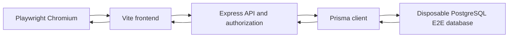

# Next-stage real browser E2E testing plan

## Decision and scope

This document is the implementation source of truth for the next E2E stage. It specifies **only** the work required to introduce five database-backed, browser-to-database workflows. It does not implement tests, scripts, CI configuration, database schema changes, or product behavior.

The target path for each test is:

### Current mocked browser tests versus target full-stack tests

| Area | Existing browser suite | Target real E2E suite |
| --- | --- | --- |
| Test configuration | [`playwright.config.ts`](../frontend/playwright.config.ts) starts only Vite on port `3100` by default. | A separate real-E2E Playwright project/config starts or is given both Vite and Express, with explicit non-conflicting ports. |
| API behavior | [`core-workflows.spec.ts`](../frontend/e2e/core-workflows.spec.ts) intercepts API responses via [`page.route()`](../frontend/e2e/core-workflows.spec.ts:5). | No `/api/**` interception, auth stubbing, response fulfillment, or browser-side fixture data. Every request reaches Express. |
| Authentication | [`fixtures.ts`](../frontend/e2e/fixtures.ts) returns a synthetic token and `system_admin` user. | The browser submits seeded non-production credentials to the real login endpoint and receives a real access/refresh session. |
| Persistence and authorization | UI contract, navigation, and mocked mutation-refresh behavior only. | Express authentication, authorization/RBAC, validation, Prisma writes, state transitions, reload persistence, and UI rendering. |
| Data safety | No backend or database is involved. | A separately named disposable PostgreSQL database only. Never a developer, shared, staging, or production database. |

The existing four mocked journeys remain fast browser-contract coverage and must stay clearly labeled as mocked. They are not evidence that a request authorizes, persists, or transitions correctly. The new real-E2E suite complements rather than replaces backend unit/integration tests.

## Repository baseline and constraints

- The frontend sends relative `/api/v1` requests through Vite proxying to `127.0.0.1:3001` in [`vite.config.ts`](../frontend/vite.config.ts:21); the real-E2E setup must make the proxy target configurable rather than assume the current default.
- [`index.ts`](../backend/src/index.ts:66) starts Express outside Jest, exposes `/health/ready` at [`index.ts`](../backend/src/index.ts:143), and starts initialization/schedulers/workers at [`index.ts`](../backend/src/index.ts:227). The E2E server must be readiness-checked and must not send external traffic or allow uncontrolled background mutation.
- Prisma uses PostgreSQL and `DATABASE_URL` in [`schema.prisma`](../backend/prisma/schema.prisma:5). Existing scripts expose migration deployment and seeding in [`backend/package.json`](../backend/package.json:14).
- [`seed.ts`](../backend/prisma/seed.ts:551) is a general development seed with fixed demonstration data and two development users. It is not an E2E isolation contract and must not become one by conditionally mixing E2E records into it.
- CI already provisions PostgreSQL for integration and empty-database migration jobs in [`ci.yml`](../.github/workflows/ci.yml:188) and [`ci.yml`](../.github/workflows/ci.yml:473), but has no Playwright install, browser test, or full-stack server orchestration job.
- The frontend provides real routes for risk/incident and operations workflows in [`App.tsx`](../frontend/src/App.tsx:55), including the audit/CAPA workspace at [`App.tsx`](../frontend/src/App.tsx:73). The plan validates only controls currently reachable in the UI; an unavailable UI step is a product gap to resolve before calling its journey browser E2E complete, not a reason to invoke the API from the test.

## Dedicated disposable E2E database

### Non-negotiable isolation rules

1. Use PostgreSQL only for this phase, matching the primary Prisma schema. The E2E `DATABASE_URL` must contain a dedicated database name such as `asset_management_e2e`, never `asset_management`, `testdb`, `testdb_empty`, staging, or production.
2. Require an explicit positive guard such as `E2E_TEST_MODE=true` and `E2E_DATABASE_NAME=asset_management_e2e`; the setup/reset command validates both before it can create, drop, truncate, migrate, seed, or connect. Reject a URL without the expected database name or with a non-local local-run host. In CI, allow only the job-owned PostgreSQL service host.
3. Do not read a developer's [`backend/.env`](../backend/.env.example:1) as the authoritative E2E configuration. A committed, secret-free template such as [`backend/.env.e2e.example`](../backend/.env.example:1) documents required names; ignored local values and CI job environment supply the URL and secrets.
4. No production credentials, email addresses, webhook destinations, cloud integration credentials, file storage, or external network calls are permitted. Use `.test` addresses and deterministic E2E-only passwords stored in local ignored configuration/CI environment rather than source.
5. Run the initial real suite serially (`workers: 1`) and reset the database before each journey. Parallelization is deferred until every suite has a proven per-worker database/schema strategy.

### Proposed environment contract

| Variable | Local/CI responsibility | Required target value/purpose |
| --- | --- | --- |
| `E2E_TEST_MODE` | E2E setup, seed, server, and Playwright processes | `true`; enables fail-closed E2E-only safeguards, never a production authentication bypass. |
| `E2E_DATABASE_NAME` | E2E setup/reset command | `asset_management_e2e` locally; CI job-owned value. Must exactly match the URL database. |
| `DATABASE_URL` | Prisma commands and Express | Dedicated PostgreSQL E2E URL. Explicitly overrides any dotenv-loaded developer URL. |
| `DB_PROVIDER` | Prisma wrapper | `postgresql`. |
| `NODE_ENV` | Express | `test` or a dedicated safe E2E runtime agreed during implementation; it must permit normal server start while retaining test-safe configuration. |
| `JWT_SECRET` | Express authentication | An E2E-only, long random CI/local value; required for real login/token issuance. |
| `PORT`, `HOST` | Express | Reserved E2E backend endpoint, for example `3101` and `127.0.0.1`. |
| `CORS_ORIGINS` | Express | Exact E2E frontend origin, for example `http://127.0.0.1:3100`. |
| `VITE_API_PROXY_TARGET` | Vite configuration to be added | `http://127.0.0.1:3101`, replacing the fixed proxy target in [`vite.config.ts`](../frontend/vite.config.ts:24). |
| `PLAYWRIGHT_BASE_URL`, `PLAYWRIGHT_PORT` | Real Playwright config | E2E frontend URL/port; retain current config values only for the mocked suite. |
| `REFRESH_TOKEN_COOKIE_SECURE`, `REFRESH_TOKEN_SAME_SITE` | Auth/cookie configuration | Local HTTP-safe E2E values, e.g. `false` and `lax`, so browser login is real and deterministic. |
| `REDIS_HOST` | Server | Unset for the initial single-process suite; current idempotency implementation falls back to in-memory storage when it is unset, per [`idempotency.ts`](../backend/src/middleware/idempotency.ts:581). |
| `INTUNE_ENABLED`, integration credentials, SMTP/webhook targets | Server | Disabled/empty/safe fixtures; they must not initiate external work. |

### Lifecycle, seed, and cleanup

Implement distinct E2E tooling under a clearly E2E-named location, not as extensions to the development seed:

1. **Preflight guard:** Parse `DATABASE_URL`, verify `E2E_TEST_MODE=true`, `DB_PROVIDER=postgresql`, exact `E2E_DATABASE_NAME` match, and allowed host. Print only redacted connection information.
2. **Reset:** Terminate E2E-only connections if needed, drop/recreate the dedicated database or reset its `public` schema, then run `prisma migrate deploy` using [`schema.prisma`](../backend/prisma/schema.prisma:5). Prefer drop/recreate for proof that migrations build an empty database; retain a schema-reset option only if local database permissions require it.
3. **E2E baseline seed:** Add a dedicated idempotent seed that creates only reference data and known E2E personas/prerequisites: roles/permissions, one organization unit, an active risk method/version, required asset type, auth settings/OIDC local-login configuration, and no scenario business records. It returns a machine-readable manifest of stable IDs/emails for test setup. The baseline must be repeatable after every reset.
4. **Scenario data:** Each test creates its named data through normal browser UI actions. Seed only reference entities that cannot yet be created through the user-visible journey, and document each as a temporary UI capability gap. Prefix all values with a journey/run identifier such as `E2E-RISK-<run-id>` for diagnostics.
5. **Teardown:** After each journey, reset and reseed before the next one; after the suite, drop/reset again in an `always` cleanup step. Cleanup failure fails local commands and is surfaced in CI, with server logs/artifacts retained first.
6. **Evidence of persistence:** The browser must reload or revisit the relevant detail/list route after each major write. Where UI does not expose a necessary linked field, add an approved test-only database verifier only after browser evidence and only against the guarded E2E URL; it must never create or mutate state and should be removed once the UI exposes the assertion.

## Real server orchestration

Create separate mock and real Playwright entry points. Keep [`playwright.config.ts`](../frontend/playwright.config.ts:6) and `frontend:e2e` behavior for mocked tests stable; add real-specific configuration and scripts such as `e2e:mock`, `e2e:real`, `e2e:real:ui`, `e2e:db:reset`, and `e2e:db:seed`. The exact filenames are implementation choices, but naming must prevent an operator mistaking mocked coverage for real coverage.

The real suite sequence is:

1. Load E2E environment, preflight the E2E database, reset, deploy migrations, generate Prisma client, and run the dedicated E2E baseline seed.
2. Start Express with the guarded E2E environment on `127.0.0.1:3101`; wait for [`/health/ready`](../backend/src/index.ts:143), not only for an open TCP port. Capture structured backend logs to the test-results directory.
3. Start Vite on `127.0.0.1:3100` (or the chosen `PLAYWRIGHT_PORT`) with `VITE_API_PROXY_TARGET` set to that Express endpoint; wait for its HTTP URL.
4. Start Playwright Chromium. Each spec logs in using the real form at [`Login.tsx`](../frontend/src/pages/Login.tsx:50), records its generated run prefix, performs UI-only mutations, reloads/revisits, and makes no `page.route()` calls for `/api/**`.
5. Stop frontend/backend processes reliably, then run always-cleanup. Preserve Playwright trace/video/screenshot plus frontend/backend logs on failure.

Before enabling the suite, introduce a server-safe E2E runtime control for schedulers, reminders, webhook queue worker, and external integrations. It must disable outbound/background side effects while leaving the real HTTP, authentication, authorization, service, Prisma, and transaction paths intact. Do not rely on `NODE_ENV=test` alone: [`index.ts`](../backend/src/index.ts:244) currently starts these services after startup.

## Test identities and RBAC

The E2E seed creates stable active, local-login, MFA-disabled users with passwords supplied through E2E environment variables:

| Persona | Role | Purpose |
| --- | --- | --- |
| `e2e.admin@example.test` | `system_admin` | Performs every lifecycle creation, transition, evidence link, CAPA action, and closure in the five journeys. |
| `e2e.manager@example.test` | `ism_manager` | Explicit allowed-write check on one representative workflow mutation and allowed read of the created record. |
| `e2e.auditor@example.test` | `auditor` | Explicit allowed-read check and denied-write check against a created record. |
| `e2e.employee@example.test` | `employee` | Explicit allowed/read-scope behavior and denied-write check against a created record. |

The baseline role model currently grants broad permissions to `system_admin` and `ism_manager`, while `auditor` is read-only and `employee` has a narrower read set in [`seed.ts`](../backend/prisma/seed.ts:21). The implementation must seed exactly those roles/permissions from the authorization source, not hard-code a duplicate permission list. Each role check is performed through separate browser storage state/session: login, navigate to a record created by admin, attempt one visible action, assert the actual success or forbidden UX/API outcome, then reload and prove no unauthorized write persisted. The first increment has one representative allow/deny matrix covering risk, incident, supplier/BCM, and audit/CAPA permission mappings; dedicated exhaustive RBAC journeys are a later expansion.

## Initial five true journeys

All unique names include the run prefix. All lifecycle mutations use the `system_admin` browser session, then selected steps use the separate RBAC sessions above. No test calls backend APIs directly to arrange domain state.

### 1. Risk → Treatment → Control → Assessment

**Prerequisites:** E2E baseline includes a usable risk method/version and asset type. If the UI cannot create a required control implementation or link it to a risk, seed the minimum reference control/implementation with a documented temporary gap; do not silently use an API setup call.

**Browser flow and assertions:**

1. Create a risk from [`Risks.tsx`](../frontend/src/pages/Risks.tsx:157) with owner, assessment inputs, and a unique title; verify risk identifier/status on its detail page after reload.
2. Add its treatment through the visible risk treatment controls and verify treatment/risk linkage survives refresh.
3. Create/select and associate a control with the risk/treatment using visible controls, then verify it appears in the risk detail/control association.
4. Record an assessment/version/control-effectiveness result using visible UI. Verify calculated/entered rating, assessment state, and control effectiveness appear after a fresh navigation.
5. RBAC: `ism_manager` can perform a representative permitted risk/treatment update; `auditor` and `employee` cannot expose or successfully submit a risk/treatment mutation. Reload as admin and assert the denied action did not change the record.

**Completion evidence:** Created risk, treatment, linked control/implementation, and assessment/version are visible after browser reload and have the expected relationship/status in the target UI.

### 2. Incident → NIS2 Assessment → Report → Close

**Prerequisites:** E2E baseline includes an organization unit and any active NIS2 questionnaire/reference configuration the UI requires. The test uses actual incident reportability/close validations.

**Browser flow and assertions:**

1. Create a significant incident from the incidents UI with deterministic detection/knowledge timestamps and incident manager; reload incident detail and verify status, significant classification, and generated notification deadline.
2. Complete and save the incident NIS2 significance/reportability assessment in [`IncidentDetail.tsx`](../frontend/src/pages/IncidentDetail.tsx:98); reload and verify assessment content/status.
3. Create the required incident report through the visible report UI, verify report status/due date, and request the visible export if the UI exposes it. Assert the report record remains on reload.
4. Satisfy visible closure prerequisites, close the incident, and confirm `closed` status and immutable/history-facing closure evidence after fresh navigation.
5. RBAC: `ism_manager` can perform an allowed incident update/report action; `auditor` may read the incident but cannot report/close; `employee` cannot mutate it. Verify no denied transition was persisted.

**Completion evidence:** The incident’s persisted detail page contains the NIS2 assessment, report, and closed lifecycle state—not mocked notification data.

### 3. Supplier → Assessment → CAPA

**Prerequisites:** The supplier and assessment forms in [`ISMSPhase6.tsx`](../frontend/src/pages/ISMSPhase6.tsx:405) are the required browser entry points. E2E baseline must include any referenced owner/user IDs exposed by the entity picker.

**Browser flow and assertions:**

1. Create a supplier in ISMS Operations and navigate using the real detail route [`App.tsx`](../frontend/src/App.tsx:75); reload and verify its display identifier and metadata.
2. Create a supplier assessment with a high/critical finding and recommended action. Reload the supplier/assessment detail and verify the assessment and finding are persisted.
3. Generate a CAPA through the supplier-origin workflow; verify the CAPA source references the supplier and is visible from the related detail/workspace.
4. Move only through state controls the UI exposes in this journey; no direct backend lifecycle API calls.
5. RBAC: `ism_manager` performs an allowed supplier/CAPA write; `auditor` has read visibility but cannot create a supplier assessment/CAPA; `employee` cannot perform the write. Refresh as admin to prove integrity after denied attempts.

**Completion evidence:** The browser shows one persisted supplier, linked assessment finding, and supplier-sourced CAPA with expected initial status/source linkage.

### 4. BIA → BCP → Exercise → CAPA

**Prerequisites:** Use current BCM routes in [`App.tsx`](../frontend/src/App.tsx:74) and APIs served by [`phase6.routes.ts`](../backend/src/routes/phase6.routes.ts:206). If BIA/BCP/exercise creation is not exposed by the UI, record it as a blocking product UI gap; this journey cannot be labeled real browser E2E until it is reachable without API arrangement.

**Browser flow and assertions:**

1. Create a BIA containing impact/recovery objectives and owner; navigate to its detail and verify persisted analysis values.
2. Create a BCP bound to that BIA with required recovery strategies, communication plan, and activation criteria; reload BCP detail and verify the BIA association.
3. Create and complete an exercise with participant/result/finding data. Reload exercise detail and verify execution/status and result/finding visibility.
4. Create a CAPA from the exercise and verify source linkage plus initial CAPA state after navigating away and back.
5. RBAC: `ism_manager` can make one permitted BCM/CAPA change; `auditor` can read but not create exercise/CAPA; `employee` cannot write. Confirm rejected writes leave no record.

**Completion evidence:** Browser-visible BIA, BCP association, executed exercise/finding, and BCP-sourced CAPA persist across reloads.

### 5. Audit → Finding → Evidence → CAPA → Effectiveness → Close

**Prerequisites:** Baseline data includes a browser-visible evidence record only if the current UI cannot create evidence; log the reason and replace it once evidence creation is exposed. The test uses the native audit workspace at [`AuditWorkspace.tsx`](../frontend/src/pages/AuditWorkspace.tsx:15).

**Browser flow and assertions:**

1. Create an audit program, then an audit, then a finding in the forms/actions shown by [`AuditWorkspace.tsx`](../frontend/src/pages/AuditWorkspace.tsx:44). Revisit each nested view and verify identifiers and relationships.
2. Use the Evidence panel to select and link the evidence. Reload finding detail and verify the evidence relation is rendered, not merely requested.
3. Generate CAPA, progress it to completed, enter an `effective` effectiveness review, and close it using the visible lifecycle buttons in [`AuditWorkspace.tsx`](../frontend/src/pages/AuditWorkspace.tsx:60).
4. Reload/navigate through the finding and audit views. Assert CAPA source linkage, final `closed` state, effectiveness status/review, and retained evidence association.
5. RBAC: `ism_manager` can perform an allowed audit/CAPA write; `auditor` can view program/audit/finding/evidence but cannot generate/update/close CAPA; `employee` cannot modify. Verify rejected writes do not alter the final lifecycle state.

**Completion evidence:** The UI shows the complete, persisted chain Audit → Finding → Evidence → CAPA → effective → closed after a new browser navigation.

## CI design

Add a dedicated `real-e2e` job to [`ci.yml`](../.github/workflows/ci.yml:25), separate from integration tests and before the final release gate. It uses a fresh PostgreSQL 16 service with a database named solely for this job. It must not reuse the `testdb` integration service/db, and it must not rely on cached database state.

### Job stages

1. Checkout, install dependencies using the repository’s current lockfile policy, build [`shared`](../shared/package.json), generate Prisma, and build backend/frontend to surface packaging/configuration errors.
2. Install Chromium and its OS dependencies with Playwright’s supported CI command. Cache browser binaries only if the cache key includes Playwright version and platform; do not cache database data.
3. Export all guarded E2E variables and disable outbound/integration/background work. Run E2E preflight, database reset, `prisma migrate deploy`, and E2E baseline seed.
4. Launch Express and Vite with separate ports and capture each process log. Poll Express `/health/ready`, then the frontend URL.
5. Execute the five serial real-E2E journeys. Retain the existing mocked Playwright suite as a separate fast job/step, so a full-stack environment failure cannot disguise loss of browser-contract coverage.
6. In `always()`, stop servers, run guarded cleanup, and upload `frontend/playwright-report`, `frontend/test-results`, E2E seed/reset logs, and frontend/backend logs. Include all artifacts on test, readiness, migration, or cleanup failure.
7. Add `real-e2e` to [`release-gates`](../.github/workflows/ci.yml:571) only after the acceptance criteria below are met and the job is required for relevant backend/frontend/Prisma/E2E/CI changes. Extend the preflight path filters to include `docs/e2e-testing.md` only if documentation-only changes are intended to exercise validation; otherwise do not make docs-only edits run the full suite.

## Incremental acceptance criteria

### Increment A — infrastructure and safety

- A dedicated E2E command rejects dangerous/mismatched URLs before any DDL/DML.
- Empty dedicated E2E database can be migrated from repository migrations and seeded repeatably.
- The seed provides all four real local-login personas and required reference data without reusing development credentials/data.
- Express and Vite launch against the guarded database; readiness is healthy; no external network service or background worker changes business data.
- Existing mocked suite continues unchanged and is explicitly named `mock`/`contract` in scripts/reports.

### Increment B — real authentication, persistence, and RBAC harness

- Playwright login executes against real Express authentication with no API route stubbing.
- Reusable real-E2E helpers create unique run IDs, login/re-login per browser storage state, wait for post-mutation UI state, and assert after reload.
- A representative `ism_manager` allow, `auditor` read/deny, and `employee` deny assertion operates through the browser and confirms no denied persistence.
- Failure artifacts identify run ID, database name (redacted URL), frontend/backend logs, trace, screenshot, and video.

### Increment C — five journey implementation

- Each numbered journey runs independently from a freshly reset/seeded database, makes no browser API interception, and completes through user-visible UI controls.
- Each confirms its final chain/status by a fresh page load/navigation and uses direct read-only DB verification only where a documented UI assertion gap remains.
- Any missing browser affordance is filed/resolved as product work before that journey is reported as browser E2E complete; no direct API test setup is permitted as a substitute.

### Increment D — CI gate

- The new CI job runs the five journeys against its own fresh PostgreSQL service after migration/seed, publishes artifacts, and always cleans its database/processes.
- The job is stable with one worker and does not depend on local env files, pre-existing ports, external services, or record order.
- Release gates require the job for relevant code/configuration changes; mocked browser tests, integration tests, migration test, and real E2E retain distinct job names and failure diagnostics.

## Implementation order

1. Add E2E environment template, URL guard, disposable database reset/migration lifecycle, and dedicated E2E seed/manifest.
2. Add safe server runtime controls for background/external work; make Vite’s proxy target configurable; define real Playwright config/scripts without altering mocked suite semantics.
3. Build shared real-login, run-id, cleanup, reload-persistence, and role-session helpers; implement representative RBAC checks.
4. Implement journeys 1–5 independently in the stated order, resolving UI reachability gaps rather than arranging domain data with test API calls.
5. Add CI real-E2E job, artifact retention, always-cleanup, then promote to release gate when Increment D criteria hold.

## Explicit non-goals for this stage

- No replacement or removal of mocked browser tests.
- No E2E execution against developer, shared test, staging, or production data stores.
- No production authentication bypasses, test-only HTTP endpoints, real external integration calls, or direct domain API setup from browser journey specs.
- No SQL Server E2E provider coverage, cross-browser matrix, parallel database workers, performance/load testing, MFA lifecycle testing, or exhaustive RBAC matrix in the initial five journeys.
