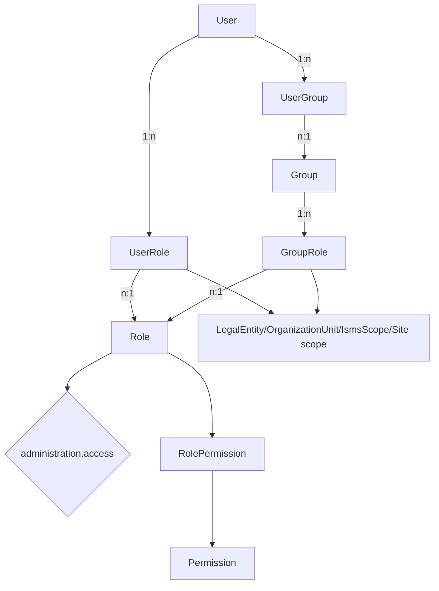
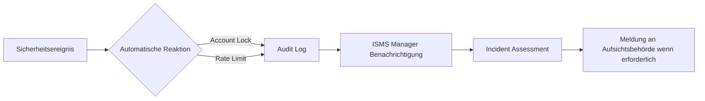

# Sicherheitskonzept – Asset Management System (ISO 27001)

**Version:** 1.0  
**Datum:** 2026-07-17  

---

## 1. Sicherheitsziele

Das System schützt vertrauliche ISMS-Daten gemäß ISO/IEC 27001:2022 und erfüllt die Anforderungen der DSGVO sowie NIS2-Richtlinie. Die drei Säulen:

| Ziel | Maßnahme |
|------|----------|
| **Vertraulichkeit** | JWT-basierte Auth, RBAC, Entity-Level Permissions, TLS |
| **Integrität** | Auditlog (schreibgeschützt), Input-Validierung, Referentielle Integrität in DB |
| **Verfügbarkeit** | Health Checks, Rate Limiting, Fehlerbehandlung |

---

## 2. Authentifizierung

### 2.1 Lokale Authentifizierung

| Parameter | Wert |
|-----------|------|
| Passwort-Hashing | bcrypt, Rounds ≥ 10 (konfigurierbar via `BCRYPT_ROUNDS`) |
| Mindestlänge | 12 Zeichen |
| Komplexität | Großbuchstaben, Kleinbuchstaben, Ziffern, Sonderzeichen |
| Token-Typ | JWT (HS256) |
| Access-Token Lifetime | 1 Stunde |
| Refresh-Token | Separate Tabelle (`RefreshToken`), Rotation bei Verwendung |

### 2.2 OIDC / Entra ID

| Parameter | Wert |
|-----------|------|
| Flow | Authorization Code + PKCE (S256) |
| Scope | `openid profile email` |
| State | Serverseitig gespeichert, TTL 10 Minuten, beim Callback validiert |
| Nonce | Pro Session generiert, gegen ID-Token `nonce` Claim geprüft |
| PKCE | `code_challenge_method=S256`, `code_verifier` im Token-Exchange |
| E-Mail-Domain-Filter | Konfigurierbar via `OidcConfig.allowedEmailDomains` |

### 2.3 JWT-Spezifikation (Ziel)

```json
{
  "header": {
    "alg": "HS256",
    "typ": "JWT"
  },
  "payload": {
    "userId": "uuid-v4",
    "email": "user@example.com",
    "roles": ["system_admin"],
    "iat": 1700000000,
    "exp": 1700003600,
    "jti": "uuid-v4"
  }
}
```

**Änderungen gegenüber Ist:**
- Algorithmus explizit `HS256` (kein Default)
- `jti` Claim für Token-Revocation
- Kein Fallback auf Hardcoded Secrets – Application startet nicht ohne `JWT_SECRET`

---

## 3. Autorisierung

### 3.1 Rollenmodell (RBAC)



**Standardrollen:**

| Rolle | Granulare Permissions | Beschreibung |
|-------|-----------------------|-------------|
| `system_admin` | alle Permissions inklusive `administration.access` | Vollzugriff auf System und Admin-Bereich |
| `ism_manager` | alle Permissions inklusive `administration.access` | ISMS-Verantwortlicher, Admin-Zugriff |
| `auditor` | Leserechte auf ISMS-/Kernmodule | Externer Auditor – Leserecht auf relevante Objekte |
| `employee` | Basis-Leserechte auf Assets, Risiken, Controls, Incidents, Training und Dokumente | Standard-Mitarbeiter |

Phase 1 ersetzt das grobe `entityPermissions`-Modell durch `Permission` und `RolePermission`. Bestehende JSON-Felder bleiben nur als Kompatibilitätspfad für Altrollen erhalten. Der Mindestkatalog umfasst `assets.read`, `assets.write`, `assets.archive`, granulare Risiko-/Control-/Incident-Aktionsrechte, ISMS-Modulrechte und `administration.access`.

Rollen können direkt über `UserRole` oder indirekt über `GroupRole` zugewiesen werden. Jede Zuweisung darf optional auf `LegalEntity`, `OrganizationUnit`, `IsmsScope` und/oder `Site` begrenzt sein. Benutzer erhalten den Vereinigungsbereich aller aktiven direkten und gruppenbasierten Zuweisungen; abgelaufene Zuweisungen sind unwirksam.

### 3.2 Entity-Level Authorization Middleware

Jede relevante Operation prüft explizite Permissions über den zentralen `AuthorizationService`:

```typescript
// Pseudocode für AuthorizationService
async function canForEntity(userId, permission, entityType, entityId): Promise<boolean> {
  const assignments = await getActiveDirectAndGroupAssignments(userId, permission);
  const entityScope = await resolveScopeViaDomainRelations(entityType, entityId);
  return assignments.some((assignment) => assignment.isUnrestricted || assignment.matches(entityScope));
}
```

List-/Suchendpunkte müssen `buildReadFilter(userId, entityType)` in dieselbe Prisma-Where-Klausel einbetten, die auch für `count` und Pagination verwendet wird. Detailendpunkte außerhalb des erlaubten Scopes geben konsistent `403` zurück. ISMS-Scope-Prüfungen vergleichen niemals Objekt-IDs direkt mit Scope-IDs, sondern lösen den Fachpfad auf, z.B. Risiko → Organisationseinheit → Legal Entity → ISMS-Scope-Mitgliedschaft.

### 3.3 Admin-Bereichsschutz

Alle Routen unter `/api/v1/admin/*` erfordern `administration.access`. Die Middleware:

1. Lädt alle UserRole-Zuordnungen des Benutzers
2. Folgt zur RolePermission-/Permission-Tabelle und prüft `administration.access`
3. Berücksichtigt auch GroupRole-Zuordnungen und Ablaufdaten

---

## 4. Auditlog

### 4.1 Protokollierte Ereignisse

| Kategorie | Aktionen | Anforderung |
|-----------|----------|-------------|
| Authentifizierung | Login, Logout, Token Refresh, Failed Login | P0 |
| Admin-Operationen | CRUD auf Users, Roles, Groups, OIDC Config | P0 |
| Asset-Management | Create, Update, Delete Assets | P1 |
| Risiko-Management | Create, Update, Accept Risk | P1 |
| Konfiguration | Alle Änderungen an Systemkonfigurationen | P0 |

### 4.2 AuditLog-Schema

```prisma
model AuditLog {
  id            String   @id @default(uuid())
  actorId       String                      // User-ID des Ausführenden
  actorType     String                      // 'user', 'system', 'oidc'
  timestamp     DateTime @default(now())
  action        String                      // 'create', 'update', 'delete', 'login', etc.
  objectId      String                      // ID der betroffenen Entität
  objectType    String                      // 'User', 'Asset', 'Risk', etc.
  previousValue Json?                       // Zustand vor Änderung
  newValue      Json?                       // Zustand nach Änderung
  origin        String?                     // 'api', 'scheduler', 'migration'
  correlationId String?                     // Request-Trace-ID
  justification String?                     // Begründung (z.B. bei Risk Acceptance)

  @@index([timestamp])
  @@index([objectId, objectType])
  @@map("audit_logs")
}
```

### 4.3 Schutzmaßnahmen

- **Kein DELETE:** Audit-Einträge sind unveränderlich (keine Update/Delete-API)
- **Soft-Delete nur auf Anwendungsebene:** Datenbank-Einträge bleiben erhalten
- **Export-Funktion:** Für Compliance-Berichte und Audits

---

## 5. Netzwerksicherheit

### 5.1 CORS-Konfiguration

| Umgebung | Origin | Credentials |
|----------|--------|-------------|
| Development | `http://localhost:*` | true |
| Staging | Konfigurierbar via `CORS_ORIGIN` | true |
| Production | Konfigurierbar via `CORS_ORIGIN` – **kein Wildcard** | true |

### 5.2 HTTP-Sicherheitsheader (Helmet.js)

```typescript
app.use(helmet({
  contentSecurityPolicy: { /* konfigurieren */ },
  crossOriginEmbedderPolicy: false,
  hsts: { maxAge: 31536000, includeSubDomains: true },
}));
```

### 5.3 Rate Limiting

| Endpoint | Limit | Fenster |
|----------|-------|---------|
| `/auth/login` | 5 Versuche | 1 Minute pro IP |
| `/auth/register` | 3 Versuche | 10 Minuten pro IP |
| `/oidc/callback` | 10 Versuche | 1 Minute pro IP |
| Alle anderen API-Endpunkte | 100 Requests | 1 Minute pro Token |

---

## 6. Datensicherheit

### 6.1 Sensible Daten

| Datentyp | Schutzmaßnahme |
|----------|---------------|
| Passwörter | bcrypt Hashing – nie im Klartext speichern oder loggen |
| JWT Secrets | Umgebungsvariable – nie im Code |
| OIDC Client Secret | Verschlüsselt in DB (zukünftig) |
| Intune/vCenter/Proxmox Credentials | `passwordEncrypted` Feld – AES-256-GCM mit Application-Key |
| PII (Namen, E-Mails) | Zugriffsbeschränkung via RBAC |

### 6.2 Datenbank-Sicherheit

- **Verbindung:** SSL/TLS für DB-Verbindung (`?ssl=require` in DATABASE_URL)
- **Benutzer:** Dedizierter DB-Benutzer mit minimalen Rechten (kein SUPERUSER)
- **Migrationen:** Nur via Prisma Migrate – keine manuellen SQL-Änderungen

### 6.3 Umgebungsvariablen

| Variable | Erforderlich | Default | Beschreibung |
|----------|-------------|---------|-------------|
| `DATABASE_URL` | Ja | – | PostgreSQL Verbindungsstring |
| `JWT_SECRET` | Ja | **Kein Default** | JWT Signatur-Secret (≥ 32 Zeichen) |
| `CORS_ORIGIN` | Production | `*` (Dev nur) | Erlaubte CORS-Origin(en) |
| `BCRYPT_ROUNDS` | Nein | `10` | bcrypt Hashing-Runden |
| `NODE_ENV` | Nein | `development` | Umgebungsmodus |

---

## 7. Sicherheitsrichtlinien

### 7.1 Passwort-Richtlinie

- Mindestlänge: 12 Zeichen
- Erfordert: Großbuchstaben, Kleinbuchstaben, Ziffern, Sonderzeichen
- Keine der letzten 5 Passwörter wiederholen
- Sperrung nach 5 fehlgeschlagenen Versuchen (30 Minuten)

### 7.2 Session-Management

- Access-Token: 1 Stunde TTL
- Refresh-Token: 7 Tage TTL mit Rotation
- Automatische Invalidierung bei Passwortänderung
- Logout invalidiert alle aktiven Sessions des Benutzers

### 7.3 Prinzip der minimalen Berechtigung

- Neue Benutzer erhalten Standardrolle `employee` (readonly auf alles)
- Admin-Zugriff muss explizit gewährt werden
- Group-basierte Rollenvergabe bevorzugt über individuelle Zuweisungen

---

## 8. Compliance-Mapping

| Anforderung | ISO 27001:2022 Control | Implementation |
|-------------|----------------------|---------------|
| IAM-001 (Admin Schutz) | A.5.15 Access control | Admin Guard Middleware |
| IAM-002 (Entity Auth) | A.5.15 Access control | Entity Authorization Middleware |
| SEC-001 (JWT Härtung) | A.8.2 Authentication | HS256 + Secret Management |
| SEC-002 (OIDC PKCE) | A.8.2 Authentication | PKCE + State/Nonce Validation |
| SEC-003 (CORS) | A.8.22 Network security | Origin Validation |
| SEC-004 (Passwort-Policy) | A.5.17 Identity management | Password Validator |
| SEC-005 (Auditlog) | A.8.15 Logging | Audit Logger Middleware |
| SEC-006 (Registrierungsschutz) | A.5.17 Identity management | Rate Limiting + Config Toggle |

---

## 9. Incident Response

### 9.1 Sicherheitsrelevante Ereignisse

| Ereignis | Reaktion |
|----------|---------|
| Mehrfache fehlgeschlagene Logins | Account-Sperre nach 5 Versuchen, Audit-Eintrag |
| JWT-Manipulationsversuch | 401 Antwort, Audit-Eintrag mit IP |
| OIDC State Mismatch | 400 Antwort, Audit-Eintrag (möglicher CSRF-Angriff) |
| Admin-Zugriff ohne Berechtigung | 403 Antwort, Audit-Eintrag mit Detail |

### 9.2 Eskalationspfad


## Phase 2 Authentication and Session Management

Phase 2 implements a database-backed refresh-token session flow without starting Phase 3+ work. Access tokens are short-lived HS256 JWTs with configurable `JWT_ACCESS_TOKEN_EXPIRES_IN` defaulting to 20 minutes. The JWT payload contains only `userId` and `email`; roles are not embedded in newly issued access tokens. Critical authorization remains database-backed through `authorizationService` and scoped permission checks.

Refresh tokens are generated with 256 bits of random entropy, stored only as SHA-256 `tokenHash` values in the `RefreshToken` model, and delivered in an HttpOnly cookie with Secure and SameSite attributes. `POST /auth/refresh` authenticates only with this cookie and does not require access-token middleware. Refresh rotates tokens by marking token A used, creating token B in the same family, and returning a new access token plus replacement cookie. Reuse of an already used or revoked refresh token revokes the full family and creates an audit event. `POST /auth/logout` revokes the current refresh token and clears the cookie.

Frontend session handling now stores the access token only in memory. Durable `localStorage` access-token use was removed. Axios retries an original request exactly once after a successful refresh, and concurrent 401 responses share one in-flight refresh request.

Phase 1 historical context: the Phase 1 integration commit included pre-existing unrelated risk-control workflow changes according to `git show --stat`. Phase 2 did not expand or refactor those unrelated changes.
