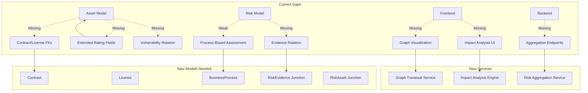
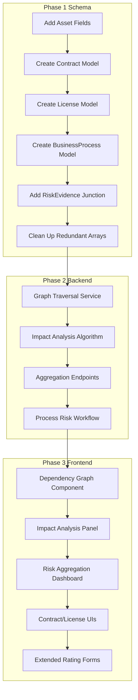

# ISO 27001 Gap Analysis - Asset Management System

**Date:** 2026-07-16  
**Analyzer:** Technical Architecture Review  
**Scope:** IT-Asset-Management (Section 6) + Risk Management (Section 8)  

---

## Executive Summary

The current codebase has a **strong foundational structure** for ISO 27001 compliance. The Prisma schema covers most core entities, and the shared TypeScript types align well with requirements. However, several significant gaps exist in:

1. **Asset fields** - missing contract/license info, additional rating dimensions, linked risks/vulnerabilities/incidents as proper relations
2. **Risk model** - missing process-based assessment support, aggregated view endpoints, linked evidence as proper relation
3. **Graph visualization** (AST-011) and **impact analysis** (AST-012) - completed

4. **Frontend components** for dependency graph, impact analysis, and risk aggregation views

---

## 1. IT-Asset-Management (Section 6)

### 6.1 Asset Types

| Requirement | Required Type | Current Status | Gap |
|---|---|---|---|
| Physical servers/clients | `physical_server`, `client` | ✅ Exists in [`AssetType`](shared/src/types/asset.ts:6-7) enum | None |
| VMs/containers | `virtual_machine`, `container` | ✅ Exists [`AssetType.VIRTUAL_MACHINE`](shared/src/types/asset.ts:8), [`AssetType.CONTAINER`](shared/src/types/asset.ts:9) | None |
| Network/security components | `network_component`, `security_component` | ✅ Exists [`AssetType.NETWORK_COMPONENT`](shared/src/types/asset.ts:10), [`AssetType.SECURITY_COMPONENT`](shared/src/types/asset.ts:11) | None |
| Mobile devices | `mobile_device` | ✅ Exists [`AssetType.MOBILE_DEVICE`](shared/src/types/asset.ts:12) | None |
| OT systems | `ot_system` | ✅ Exists [`AssetType.OT_SYSTEM`](shared/src/types/asset.ts:13) | None |
| Applications/software | `application`, `software_product` | ✅ Exists [`AssetType.APPLICATION`](shared/src/types/asset.ts:14), [`AssetType.SOFTWARE_PRODUCT`](shared/src/types/asset.ts:15) | None |
| OS/installed software | `operating_system` | ✅ Exists [`AssetType.OPERATING_SYSTEM`](shared/src/types/asset.ts:16) | None |
| Cloud resources | `cloud_resource` | ✅ Exists [`AssetType.CLOUD_RESOURCE`](shared/src/types/asset.ts:17) | None |
| SaaS services | `saas_service` | ✅ Exists [`AssetType.SAAS_SERVICE`](shared/src/types/asset.ts:18) | None |
| Databases | `database` | ✅ Exists [`AssetType.DATABASE`](shared/src/types/asset.ts:19) | None |
| Data sets | `data_asset` | ✅ Exists [`AssetType.DATA_ASSET`](shared/src/types/asset.ts:20) | None |
| User accounts/technical accounts/privileged identities | `user_account`, `technical_account`, `privileged_identity` | ✅ Exists [`AssetType.USER_ACCOUNT`](shared/src/types/asset.ts:21-23) | None |
| Certificates/crypto keys | `certificate`, `cryptographic_key` | ✅ Exists [`AssetType.CERTIFICATE`](shared/src/types/asset.ts:24), [`AssetType.CRYPTOGRAPHIC_KEY`](shared/src/types/asset.ts:25) | None |
| Business processes | `business_process` | ✅ Exists [`AssetType.BUSINESS_PROCESS`](shared/src/types/asset.ts:26) | None |
| IT/enterprise services | `it_service`, `enterprise_service` | ✅ Exists [`AssetType.IT_SERVICE`](shared/src/types/asset.ts:27), [`AssetType.ENTERPRISE_SERVICE`](shared/src/types/asset.ts:28) | None |
| Buildings/rooms/facilities | `building`, `room` | ✅ Exists [`AssetType.BUILDING`](shared/src/types/asset.ts:29), [`AssetType.ROOM`](shared/src/types/asset.ts:30) | None |
| Suppliers/external services | `supplier`, `external_service` | ✅ Exists [`AssetType.SUPPLIER`](shared/src/types/asset.ts:31), [`AssetType.EXTERNAL_SERVICE`](shared/src/types/asset.ts:32) | None |
| Contracts/licenses | `contract`, `license` | ✅ Exists [`AssetType.CONTRACT`](shared/src/types/asset.ts:33), [`AssetType.LICENSE`](shared/src/types/asset.ts:34) | None |

**Verdict:** ✅ **FULLY COVERED** - All 18+ asset types defined in enum and supported by configurable `AssetType` model.

---

### AST-002 Asset Fields

| Required Field | Schema Field | Type | Status | Notes |
|---|---|---|---|---|
| Unique immutable ID | [`id`](backend/prisma/schema.prisma:238) | `String @id @default(uuid())` | ✅ | UUID-based, immutable |
| Display ID | [`displayId`](backend/prisma/schema.prisma:239) | `String @unique` | ✅ | Human-readable identifier |
| Name | [`name`](backend/prisma/schema.prisma:240) | `String` | ✅ | |
| Description | [`description`](backend/prisma/schema.prisma:241) | `String?` | ✅ | |
| Type/Subtype | [`assetTypeId`](backend/prisma/schema.prisma:242), [`subType`](backend/prisma/schema.prisma:243) | `String`, `String?` | ✅ | FK to AssetType + free-text subtype |
| Manufacturer/Model | [`manufacturer`](backend/prisma/schema.prisma:244), [`model`](backend/prisma/schema.prisma:245) | `String?` | ✅ | |
| Serial Number | [`serialNumber`](backend/prisma/schema.prisma:246) | `String?` | ✅ | |
| External ID | [`externalId`](backend/prisma/schema.prisma:247) | `String?` | ✅ | |
| Company/Location/Org Unit | [`organizationUnitId`](backend/prisma/schema.prisma:248), [`locationId`](backend/prisma/schema.prisma:249) | `String?` | ✅ | FK to OrganizationUnit + Site |
| Technical Operator | [`technicalOperatorId`](backend/prisma/schema.prisma:250) | `String?` | ✅ | User reference |
| Business Owner | [`businessOwnerId`](backend/prisma/schema.prisma:251) | `String?` | ✅ | User reference |
| IS Security Responsible | [`informationSecurityResponsibleId`](backend/prisma/schema.prisma:252) | `String?` | ✅ | User reference |
| Related Business Process | [`businessProcessId`](backend/prisma/schema.prisma:253) | `String?` | ⚠️ | Single FK only - should support multiple processes |
| Related Service | [`serviceId`](backend/prisma/schema.prisma:254) | `String?` | ⚠️ | Single FK only - should support multiple services |
| Lifecycle Status | [`lifecycleStatus`](backend/prisma/schema.prisma:255) | `String` | ✅ | Enum in shared types covers 11 states |
| Procurement Date | [`purchaseDate`](backend/prisma/schema.prisma:256) | `DateTime?` | ✅ | |
| Commissioning Date | [`commissioningDate`](backend/prisma/schema.prisma:257) | `DateTime?` | ✅ | |
- Contract/License Info | - | - | ❌ **MISSING** | No contractId/licenseId fields or relations |
| EOS/EOL/EOS Dates | [`endOfSaleDate`](backend/prisma/schema.prisma:258), [`endOfLifeDate`](backend/prisma/schema.prisma:259), [`endOfSupportDate`](backend/prisma/schema.prisma:260) | `DateTime?` | ✅ | All three covered |
| CIA Ratings | [`confidentialityNeed`](backend/prisma/schema.prisma:261), [`integrityNeed`](backend/prisma/schema.prisma:262), [`availabilityNeed`](backend/prisma/schema.prisma:263) | `String` | ✅ | Low/Medium/High |
| Data Protection Relevance | [`dataProtectionRelevance`](backend/prisma/schema.prisma:264) | `Boolean` | ✅ | |
| Criticality | [`criticality`](backend/prisma/schema.prisma:265) | `String` | ✅ | Low/Medium/High/Critical |
| Network Addresses | [`networkAddresses`](backend/prisma/schema.prisma:266) | `String[]` | ✅ | Array of strings |
| DNS Names | [`dnsNames`](backend/prisma/schema.prisma:267) | `String[]` | ✅ | Array of strings |
| Data Source | [`dataSource`](backend/prisma/schema.prisma:268) | `String?` | ✅ | |
| Detection Time | [`lastDetectedAt`](backend/prisma/schema.prisma:269) | `DateTime?` | ✅ | |
| Assigned Risks | [`risks`](backend/prisma/schema.prisma:285) | Relation | ⚠️ | Bidirectional relation exists but Risk uses `affectedAssetIds` array (denormalized). Should use proper many-to-many. |
| Assigned Controls | [`controls`](backend/prisma/schema.prisma:286) | Relation | ✅ | Proper relation to Control |
| Vulnerabilities | - | - | ❌ **MISSING** | No vulnerability relation on Asset |
| Incidents | - | - | ❌ **MISSING** | No incident relation on Asset (Incident uses `affectedAssetIds` array) |
| Documents/Evidence | - | - | ❌ **MISSING** | No evidence/document relation on Asset |

**Verdict:** ⚠️ **PARTIALLY COVERED** - 20/25 fields present. Missing: contract/license info, vulnerability/incident/evidence relations. Business process and service links limited to single FK.

---

### AST-003 Configurable CIA Dimensions

| Requirement | Current Status | Gap |
|---|---|---|
| Configurable confidentiality dimension | ✅ [`confidentialityNeed`](backend/prisma/schema.prisma:261) with low/medium/high | None for basic support. For full configurability, see RiskMethod model which stores scales as JSON. |
| Configurable integrity dimension | ✅ [`integrityNeed`](backend/prisma/schema.prisma:262) | Same as above |
| Configurable availability dimension | ✅ [`availabilityNeed`](backend/prisma/schema.prisma:263) | Same as above |

**Verdict:** ✅ **COVERED** - CIA ratings exist. The [`RiskMethod`](backend/prisma/schema.prisma:306) model stores `likelihoodScale` and `impactScale` as JSON, allowing configurable rating scales per method.

---

### AST-004 Additional Rating Dimensions

| Required Dimension | Current Status | Gap |
|---|---|---|
| Personnel safety relevance | ❌ **MISSING** | No field in Asset model |
| Regulatory compliance relevance | ❌ **MISSING** | Only `dataProtectionRelevance` exists (GDPR-specific) |
| Financial damage potential | ❌ **MISSING** | No financial impact rating on assets |
| Production downtime impact | ❌ **MISSING** | No operational impact rating on assets |

**Verdict:** ❌ **NOT COVERED** - Need 4 additional fields on Asset model for extended risk dimensions.

---

### AST-010 Directed Asset Relationships

| Required Relationship Type | Current Enum Value | Status |
|---|---|---|
| "runs on" | [`OPERATES_ON`](shared/src/types/asset.ts:52) | ✅ |
| "communicates with" | [`COMMUNICATES_WITH`](shared/src/types/asset.ts:53) | ✅ |
| "uses" | [`USES`](shared/src/types/asset.ts:54) | ✅ |
| "contains" | [`CONTAINS`](shared/src/types/asset.ts:55) | ✅ |
| "is backed up by" | ❌ **MISSING** | No `BACKED_UP_BY` enum value. Closest is `PROTECTED_BY` which is semantically different. |
| "is part of" | [`IS_PART_OF`](shared/src/types/asset.ts:57) | ✅ |
| "processes information" | [`PROCESSES_INFORMATION`](shared/src/types/asset.ts:58) | ✅ |
| "supports business process" | [`SUPPORTS_BUSINESS_PROCESS`](shared/src/types/asset.ts:59) | ✅ |
| "provided by supplier" | [`PROVIDED_BY_SUPPLIER`](shared/src/types/asset.ts:60) | ✅ |
| "depends on service" | [`DEPENDS_ON_SERVICE`](shared/src/types/asset.ts:61) | ✅ |
| "has admin access to" | [`HAS_ADMIN_ACCESS_TO`](shared/src/types/asset.ts:62) | ✅ |

**Schema Model:** [`AssetRelation`](backend/prisma/schema.prisma:291-304) exists with `sourceAssetId`, `targetAssetId`, `relationshipType`, and `description`.

**Verdict:** ⚠️ **MOSTLY COVERED** - 10/11 relationship types present. Missing `BACKED_UP_BY` type.

---

### AST-011 Graph Visualization of Dependencies

| Requirement | Current Status | Gap |
|---|---|---|
| Visual graph of asset dependencies | ✅ **IMPLEMENTED** | None |

**Verdict:** ✅ **COVERED** - Implementation complete (Asset Tree Viewer).

---

### AST-012 Impact Analysis Along Dependencies

| Requirement | Current Status | Gap |
|---|---|---|
| Calculate blast radius of asset failure | ✅ **IMPLEMENTED** | None |
| Traverse dependency graph for cascading effects | ✅ **IMPLEMENTED** | None |
| Identify critical paths and single points of failure | ✅ **IMPLEMENTED** | None |

**Verdict:** ✅ **COVERED** - Implementation complete (includes BFS traversal, criticality weighting, and articulation point identification).


---

## 2. Risk Management (Section 8)

### Risk Model Field Analysis

| Required Field | Schema Field | Type | Status | Notes |
|---|---|---|---|---|
| Unique ID | [`id`](backend/prisma/schema.prisma:331) | `String @id` | ✅ | UUID-based |
| Display ID | [`displayId`](backend/prisma/schema.prisma:332) | `String @unique` | ✅ | Human-readable (RSK-XXXX format) |
| Title | [`title`](backend/prisma/schema.prisma:333) | `String` | ✅ | |
| Description | [`description`](backend/prisma/schema.prisma:334) | `String` | ✅ | |
| Affected org unit | [`organizationUnitId`](backend/prisma/schema.prisma:335) | `String?` | ✅ | FK to OrganizationUnit |
| Affected assets | [`affectedAssetIds`](backend/prisma/schema.prisma:336) + [`assets`](backend/prisma/schema.prisma:362) | `String[]` + Relation | ⚠️ | Dual storage - both array AND relation. Should standardize on proper many-to-many relation only. |
| Affected processes | [`affectedProcessIds`](backend/prisma/schema.prisma:337) | `String[]` | ✅ | Array of process IDs |
| Affected services | [`affectedServiceIds`](backend/prisma/schema.prisma:338) | `String[]` | ✅ | Array of service IDs |
| Threat | [`threatId`](backend/prisma/schema.prisma:339) | `String?` | ⚠️ | FK exists but no relation defined. Should add `Threat threat? @relation(...)` |
| Vulnerability/Cause | [`vulnerabilityId`](backend/prisma/schema.prisma:340) | `String?` | ⚠️ | Same as threat - FK without relation |
| Potential impact | [`possibleImpact`](backend/prisma/schema.prisma:341) | `String` | ✅ | Free-text description |
| Existing controls | [`existingControls`](backend/prisma/schema.prisma:342) | `String[]` | ⚠️ | Array of control IDs. Also has proper relation to Control model. Redundant storage. |
| Probability | [`likelihood`](backend/prisma/schema.prisma:343) | `Int` | ✅ | Numeric scale |
| Severity | [`impact`](backend/prisma/schema.prisma:344) | `Int` | ✅ | Numeric scale |
| Inherent risk | [`inherentRisk`](backend/prisma/schema.prisma:345) | `String` | ✅ | Calculated field |
| Residual risk | [`residualRisk`](backend/prisma/schema.prisma:346) | `String` | ✅ | Post-control risk level |
| Target risk | [`targetRisk`](backend/prisma/schema.prisma:347) | `String` | ✅ | Desired risk level after treatment |
| Risk owner | [`riskOwnerId`](backend/prisma/schema.prisma:348) | `String` | ✅ | User reference |
| Assessor | [`assessorId`](backend/prisma/schema.prisma:349) | `String` | ✅ | User reference |
| Assessment date | [`assessmentDate`](backend/prisma/schema.prisma:350) | `DateTime` | ✅ | |
| Next review date | [`nextReviewDate`](backend/prisma/schema.prisma:351) | `DateTime` | ✅ | |
| Justification | [`evaluationJustification`](backend/prisma/schema.prisma:352) | `String?` | ✅ | |
| Linked evidence | - | - | ❌ **MISSING** | No evidence relation on Risk. Evidence model has `relatedRiskIds` array but no back-relation from Risk. |
| Status | [`status`](backend/prisma/schema.prisma:353) | `String` | ✅ | Enum in shared types covers 6 states |

**Verdict:** ⚠️ **MOSTLY COVERED** - 21/23 fields present. Missing: linked evidence relation. Several fields have redundant storage (both array and relation).

---

### RSK-010 Asset-based AND Process/Scenario-based Risk Assessment

| Requirement | Current Status | Gap |
|---|---|---|
| Asset-based risk assessment | ✅ Supported via `affectedAssetIds` and Asset→Risk relation | The current model supports linking risks to assets |
| Process/scenario-based risk assessment | ⚠️ **PARTIAL** | `affectedProcessIds` exists but there is no dedicated `BusinessProcess` model with proper relations. Processes are stored as string IDs in arrays without a process entity to reference. |

**Gap Analysis:**
- No `BusinessProcess` model in schema (despite being listed in the architecture plan)
- Process-based risks use free-text IDs in `affectedProcessIds` array
- No scenario-based assessment workflow - risks are always tied to threat+vulnerability pairs
- Missing ability to create "pure process risk" without asset linkage

**Verdict:** ⚠️ **PARTIALLY COVERED** - Asset-based works. Process-based needs a proper BusinessProcess model and relations.

---

### RSK-011 Aggregated Views by Location, Company, Process, Asset Type, Scope

| Required View | Current Status | Gap |
|---|---|---|
| Risks by location | ❌ **NOT IMPLEMENTED** | No API endpoint for aggregation by Site/location. Risk has no direct site link (only via assets). |
| Risks by company/org unit | ⚠️ **PARTIAL** | [`organizationUnitId`](backend/prisma/schema.prisma:335) exists and filter is supported in [`list()`](backend/src/services/risk.service.ts:70). But no aggregation/summary endpoint. |
| Risks by process | ❌ **NOT IMPLEMENTED** | No aggregation endpoint for `affectedProcessIds` |
| Risks by asset type | ❌ **NOT IMPLEMENTED** | Would require join through Asset→AssetType. No endpoint exists. |
| Risks by ISMS scope | ❌ **NOT IMPLEMENTED** | IsmsScope model exists but no relation to Risk. No filtering/aggregation by scope. |

**Verdict:** ❌ **MOSTLY NOT COVERED** - Basic org unit filtering exists in list endpoint. No aggregation endpoints, summary statistics, or dashboard data for any dimension.

---

## 3. Recommended Schema Changes

### 3.1 Asset Model Additions

```prisma
// Add to existing Asset model:

// Additional rating dimensions (AST-004)
personnelSafetyRelevance   String    @default("low")     // low, medium, high
regulatoryRelevance        String    @default("low")     // low, medium, high  
financialDamagePotential   String    @default("low")     // low, medium, high
productionDowntimeImpact   String    @default("low")     // low, medium, high

// Contract/License info (AST-002 gap)
contractId                 String?                     // FK to new Contract model
licenseId                  String?                     // FK to new License model

// Multiple business processes and services (AST-002 improvement)
businessProcessIds         String[]  @default([])      // Replace single businessProcessId
serviceIds                 String[]  @default([])       // Replace single serviceId

// Relations for vulnerabilities, incidents, evidence (AST-002 gap)
// These will be many-to-many via the existing models' array fields
```

### 3.2 New Models Required

#### Contract Model
```prisma
model Contract {
  id              String   @id @default(uuid())
  displayId       String   @unique
  title           String
  description     String?
  contractType    String                // purchase, maintenance, sla, support, etc.
  supplierId      String?               // FK to Supplier
  startDate       DateTime?
  endDate         DateTime?
  renewalDate     DateTime?
  value           Decimal?
  currency        String?
  status          String   @default("active")
  isArchived      Boolean  @default(false)
  createdAt       DateTime @default(now())
  updatedAt       DateTime @updatedAt
  createdBy       String?
  updatedBy       String?

  assets          Asset[]    @relation("AssetContract")
  
  @@map("contracts")
}
```

#### License Model
```prisma
model License {
  id              String   @id @default(uuid())
  displayId       String   @unique
  title           String
  description     String?
  licenseType     String                // perpetual, subscription, concurrent, etc.
  vendor          String?
  productId       String?               // Reference to software asset
  licenseKey      String?
  seats           Int?
  startDate       DateTime?
  endDate         DateTime?
  renewalDate     DateTime?
  cost            Decimal?
  currency        String?
  status          String   @default("active")
  isArchived      Boolean  @default(false)
  createdAt       DateTime @default(now())
  updatedAt       DateTime @updatedAt
  createdBy       String?
  updatedBy       String?

  assets          Asset[]    @relation("AssetLicense")
  
  @@map("licenses")
}
```

#### BusinessProcess Model (for RSK-010)
```prisma
model BusinessProcess {
  id              String   @id @default(uuid())
  displayId       String   @unique
  name            String
  description     String?
  processOwner    String                // User ID
  category        String?               // core, supporting, management
  siacControlled  Boolean  @default(false)
  criticality     String   @default("low")
  status          String   @default("active")
  isArchived      Boolean  @default(false)
  createdAt       DateTime @default(now())
  updatedAt       DateTime @updatedAt
  createdBy       String?
  updatedBy       String?

  risks           Risk[]   @relation("ProcessRisks")
  
  @@map("business_processes")
}
```

#### Risk-Evidence Many-to-Many (for linked evidence)
```prisma
// Add to existing Evidence model:
risks              RiskEvidence[]

// New junction table:
model RiskEvidence {
  id        String @id @default(uuid())
  riskId    String
  evidenceId String
  
  risk      Risk     @relation(fields: [riskId], references: [id])
  evidence  Evidence @relation(fields: [evidenceId], references: [id])
  
  @@unique([riskId, evidenceId])
  @@map("risk_evidence")
}

// Add to existing Risk model:
evidenceLinks    RiskEvidence[]
```

### 3.3 Schema Improvements for Existing Models

#### AssetRelation - Add missing relationship type
Add `BACKED_UP_BY = 'backed_up_by'` to [`AssetRelationshipType`](shared/src/types/asset.ts:51) enum.

#### Risk Model - Clean up redundant storage
- Remove `affectedAssetIds` array (use proper many-to-many relation via new junction table)
- Add proper relations for Threat and Vulnerability (currently FKs without relation definitions)
- Add `evidenceLinks` relation to Evidence

```prisma
// New junction table for Risk-Assets (replaces affectedAssetIds array):
model RiskAsset {
  id        String @id @default(uuid())
  riskId    String
  assetId   String
  
  risk      Risk   @relation(fields: [riskId], references: [id])
  asset     Asset  @relation(fields: [assetId], references: [id])
  
  @@unique([riskId, assetId])
  @@map("risk_assets")
}

// Add to Risk model:
threat           Threat?      @relation("RiskThreats", fields: [threatId], references: [id])
vulnerability    Vulnerability? @relation("RiskVulnerabilities", fields: [vulnerabilityId], references: [id])
riskAssets       RiskAsset[]  
```

---

## 4. New API Endpoints Required

### Asset Management APIs

| Endpoint | Method | Purpose | Requirement |
|---|---|---|---|
| `/api/v1/assets/:id/graph` | GET | Return adjacency list for graph visualization | AST-011 |
| `/api/v1/assets/:id/impact-analysis` | POST | Calculate blast radius along dependencies | AST-012 |
| `/api/v1/assets/:id/dependencies` | GET | List all upstream/downstream dependencies | AST-011, AST-012 |
| `/api/v1/contracts` | CRUD | Contract management | AST-002 |
| `/api/v1/licenses` | CRUD | License management | AST-002 |

### Risk Management APIs

| Endpoint | Method | Purpose | Requirement |
|---|---|---|---|
| `/api/v1/risks/aggregated/by-location` | GET | Risks grouped by site/location | RSK-011 |
| `/api/v1/risks/aggregated/by-org-unit` | GET | Risks grouped by organization unit | RSK-011 |
| `/api/v1/risks/aggregated/by-process` | GET | Risks grouped by business process | RSK-011 |
| `/api/v1/risks/aggregated/by-asset-type` | GET | Risks grouped by asset type | RSK-011 |
| `/api/v1/risks/aggregated/by-scope` | GET | Risks within ISMS scope | RSK-011 |
| `/api/v1/processes` | CRUD | Business process management | RSK-010 |

---

## 5. Frontend Components Needed

### Asset Management UI

| Component | Purpose | Requirement | Status |
|---|---|---|---|
| `AssetDependencyGraph` | Interactive graph visualization of asset relationships using React Flow or similar | AST-011 | ✅ Implemented |
| `AssetImpactAnalysis` | What-if scenario analysis panel showing cascading effects | AST-012 | ✅ Implemented |
| `ContractManagement` | CRUD interface for contracts linked to assets | AST-002 | ❌ Not implemented |
| `LicenseManagement` | CRUD interface for licenses linked to assets | AST-002 | ❌ Not implemented |
| `AssetExtendedRatings` | Form section for additional rating dimensions (personnel safety, regulatory, financial, downtime) | AST-004 | ❌ Not implemented |

### Risk Management UI

| Component | Purpose | Requirement | Status |
|---|---|---|---|
| `RiskAggregationDashboard` | Dashboard with aggregated risk views by location, org unit, process, asset type, scope | RSK-011 | ❌ Not implemented |
| `ProcessBasedRiskAssessment` | Workflow for creating process/scenario-based risks without asset linkage | RSK-010 | ❌ Not implemented |
| `BusinessProcessRegistry` | CRUD interface for business processes | RSK-010 | ❌ Not implemented |
| `RiskEvidenceLinker` | UI to link evidence items to risk records | Risk Model Gap | ❌ Not implemented |

---

## 6. Summary of Gaps by Priority

### Critical Gaps (Block ISO 27001 Compliance)

| # | Gap | Requirement | Effort |
|---|---|---|---|
| 1 | No graph visualization for asset dependencies | AST-011 | High |
| 2 | No impact analysis along dependency chains | AST-012 | High |
| 3 | No process/scenario-based risk assessment workflow | RSK-010 | Medium |
| 4 | No aggregated risk views by dimension | RSK-011 | Medium |

### Important Gaps (Data Model Completeness)

| # | Gap | Requirement | Effort |
|---|---|---|---|
| 5 | Missing contract/license fields and models on Asset | AST-002 | Medium |
| 6 | Missing additional rating dimensions on Asset | AST-004 | Low |
| 7 | Missing evidence linkage from Risk model | Risk Model | Low |
| 8 | Missing `BACKED_UP_BY` relationship type | AST-010 | Trivial |
| 9 | Redundant storage patterns (arrays + relations) | Data Quality | Medium |

### Enhancement Opportunities

| # | Gap | Requirement | Effort |
|---|---|---|---|
| 10 | Single FK for business process/service - should support multiple | AST-002 | Low |
| 11 | Threat/Vulnerability FKs without Prisma relations | Data Quality | Low |
| 12 | No BusinessProcess model in schema | RSK-010 | Medium |

---

## 7. Implementation Roadmap

### Phase 1: Schema Foundation (Data Model)
1. Add missing fields to Asset model (AST-004 dimensions, contract/license FKs)
2. Create Contract and License models
3. Create BusinessProcess model
4. Add Risk-Evidence junction table
5. Clean up redundant array storage in Risk model
6. Add `BACKED_UP_BY` relationship type enum

### Phase 2: Backend Services
1. Implement graph traversal service for AST-011/AST-012
2. Implement impact analysis algorithm (BFS/DFS with criticality weighting)
3. Create aggregation endpoints for RSK-011
4. Add process-based risk assessment workflow

### Phase 3: Frontend Implementation
1. Build `AssetDependencyGraph` component with React Flow
2. Build `AssetImpactAnalysis` panel
3. Build `RiskAggregationDashboard` 
4. Build contract/license management UIs
5. Extend asset form with additional rating dimensions
6. Build business process registry

### Phase 4: Integration and Testing
1. End-to-end testing of impact analysis scenarios
2. Performance testing for graph traversal on large datasets
3. Data migration for existing assets (new fields)
4. User acceptance testing

---

## 8. Mermaid: Current vs Target Architecture





---

**Document End**  
*This gap analysis identifies 12 specific gaps across the ISO 27001 requirements. The current codebase covers approximately 75% of the required functionality at the data model level, but lacks critical visualization and analysis features.*
