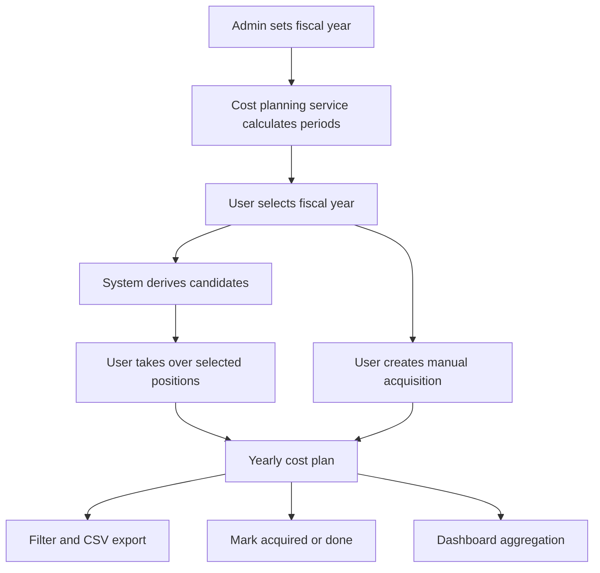

# Technical Implementation Plan: Cost Planning and Fiscal-Year Reporting

**Scope:** Architecture and implementation plan only. No production code changes are included in this plan.  
**Primary feature areas:** Fiscal-year admin setting, cost-planning menu and workflows, derived investment-relevant positions, yearly cost-plan takeover, manual planned acquisitions, category filtering and CSV export, acquisition completion metadata, dashboard cost report.  
**Security context:** The P0/P1 findings from [`docs/repository-assessment.md`](../docs/repository-assessment.md) are mandatory constraints for the implementation.

## 1. Current-state summary

Relevant code areas reviewed:

- Data model: [`backend/prisma/schema.prisma`](../backend/prisma/schema.prisma)
- Admin routes: [`backend/src/routes/admin.routes.ts`](../backend/src/routes/admin.routes.ts)
- Asset routes and lifecycle patterns: [`backend/src/routes/asset.routes.ts`](../backend/src/routes/asset.routes.ts), [`backend/src/services/asset.service.ts`](../backend/src/services/asset.service.ts)
- Contract/license routes: [`backend/src/routes/contract.routes.ts`](../backend/src/routes/contract.routes.ts), [`backend/src/routes/license.routes.ts`](../backend/src/routes/license.routes.ts)
- Authorization layer: [`backend/src/middleware/entityAuth.ts`](../backend/src/middleware/entityAuth.ts), [`backend/src/services/authorization.service.ts`](../backend/src/services/authorization.service.ts)
- Frontend routing/navigation/API: [`frontend/src/App.tsx`](../frontend/src/App.tsx), [`frontend/src/components/Layout.tsx`](../frontend/src/components/Layout.tsx), [`frontend/src/services/api.ts`](../frontend/src/services/api.ts)
- Dashboard: [`frontend/src/pages/Dashboard.tsx`](../frontend/src/pages/Dashboard.tsx)
- Existing asset/license/contract masks: [`frontend/src/pages/Assets.tsx`](../frontend/src/pages/Assets.tsx), [`frontend/src/pages/Licenses.tsx`](../frontend/src/pages/Licenses.tsx), [`frontend/src/pages/Contracts.tsx`](../frontend/src/pages/Contracts.tsx)
- Localizations: [`frontend/src/locales/de.json`](../frontend/src/locales/de.json), [`frontend/src/locales/en.json`](../frontend/src/locales/en.json)

Key constraints from the assessment:

- No user-facing UUID entry. Users must select objects via search/select components or rely on server-side ID/display-ID generation.
- New owner/responsible fields must use real relations to [`User`](../backend/prisma/schema.prisma), not free-text UUID strings.
- New routes must not use legacy role checks such as `authorize('system_admin')`; use the centralized authorization middleware pattern.
- New feature permissions must avoid default-allow behavior and be explicitly seeded/configured.
- New APIs require validation, audit logging, and documentation.

## 2. Target capabilities

The implementation should deliver:

1. Admin setting for fiscal-year start month/day.
2. New main navigation item `Kostenplanung` / `Cost Planning`.
3. Cost-planning page with selectable fiscal years.
4. Automatic derivation of investment-relevant positions from assets, licenses, and contracts.
5. Explicit takeover of derived positions into a yearly cost plan.
6. Manual planned acquisitions not yet represented by an existing asset/license/contract.
7. Filtering by categories and CSV export.
8. Marking a planned position as acquired/completed with supplier, invoice number, and invoice date.
9. Dashboard cost report for:
   - current fiscal year,
   - known costs of the next fiscal year,
   - historical cost development graph over previous fiscal years.

## 3. Proposed data model

Add a dedicated cost-planning domain instead of overloading existing asset/license/contract records.

### 3.1 Fiscal-year settings

Add model:

```prisma
model FiscalYearConfig {
  id              String   @id @default(uuid())
  startMonth      Int      @default(1)
  startDay        Int      @default(1)
  timezone        String   @default("Europe/Berlin")
  updatedByUserId String?
  updatedBy       User?    @relation(fields: [updatedByUserId], references: [id], onDelete: SetNull)
  createdAt       DateTime @default(now())
  updatedAt       DateTime @updatedAt

  @@map("fiscal_year_configs")
}
```

Design decisions:

- Single-row configuration. The service creates defaults if missing.
- `startMonth` range: `1..12`; `startDay` validated against the selected month.
- `timezone` defaults to `Europe/Berlin`; all fiscal-year boundaries are calculated in that timezone and converted to UTC for DB filters.
- `updatedByUserId` is relational to [`User`](../backend/prisma/schema.prisma), not manually entered.

### 3.2 Cost-plan header

Add model:

```prisma
model CostPlan {
  id              String   @id @default(uuid())
  displayId       String   @unique
  fiscalYearLabel String
  periodStart     DateTime
  periodEnd       DateTime
  currency        String   @default("EUR")
  status          String   @default("draft") // draft, reviewed, approved, archived
  notes           String?
  ownerUserId     String?
  owner           User?    @relation(fields: [ownerUserId], references: [id], onDelete: SetNull)
  isArchived      Boolean  @default(false)
  createdAt       DateTime @default(now())
  updatedAt       DateTime @updatedAt
  createdByUserId String?
  updatedByUserId String?

  items CostPlanItem[]

  @@unique([fiscalYearLabel])
  @@index([periodStart, periodEnd])
  @@index([status])
  @@map("cost_plans")
}
```

Design decisions:

- One active plan per fiscal-year label.
- `displayId` generated by [`backend/src/services/displayId.service.ts`](../backend/src/services/displayId.service.ts), e.g. `CPLAN-0001`.
- Users select owner via user search; no UUID entry.

### 3.3 Cost-plan positions

Add model:

```prisma
model CostPlanItem {
  id                  String    @id @default(uuid())
  displayId           String    @unique
  costPlanId          String
  sourceType          String    // asset, license, contract, manual
  sourceAssetId       String?
  sourceLicenseId     String?
  sourceContractId    String?
  title               String
  description         String?
  category            String    // hardware, software, license, contract, maintenance, support, cloud, security, other
  investmentType      String    // replacement, renewal, expansion, new_acquisition, maintenance, subscription
  relevanceReason     String?
  plannedAmount       Decimal
  knownAmount         Decimal?
  currency            String    @default("EUR")
  plannedDate         DateTime?
  dueDate             DateTime?
  status              String    @default("planned") // candidate, planned, approved, ordered, acquired, done, rejected, cancelled
  supplierId          String?
  supplierName        String?
  invoiceNumber       String?
  invoiceDate         DateTime?
  acquiredAt          DateTime?
  completedAt         DateTime?
  completedByUserId   String?
  createdAt           DateTime  @default(now())
  updatedAt           DateTime  @updatedAt
  createdByUserId     String?
  updatedByUserId     String?

  costPlan       CostPlan  @relation(fields: [costPlanId], references: [id], onDelete: Cascade)
  sourceAsset    Asset?    @relation(fields: [sourceAssetId], references: [id], onDelete: SetNull)
  sourceLicense  License?  @relation(fields: [sourceLicenseId], references: [id], onDelete: SetNull)
  sourceContract Contract? @relation(fields: [sourceContractId], references: [id], onDelete: SetNull)
  completedBy    User?     @relation(fields: [completedByUserId], references: [id], onDelete: SetNull)

  @@index([costPlanId, status])
  @@index([category])
  @@index([sourceType])
  @@index([plannedDate])
  @@index([dueDate])
  @@unique([costPlanId, sourceType, sourceAssetId])
  @@unique([costPlanId, sourceType, sourceLicenseId])
  @@unique([costPlanId, sourceType, sourceContractId])
  @@map("cost_plan_items")
}
```

Important note for implementation: Prisma/PostgreSQL nullable unique semantics allow multiple `NULL` values; test manual items and mixed sources explicitly. If this proves awkward, replace the three unique constraints with a normalized `sourceKey String?` like `asset:<id>`, `license:<id>`, `contract:<id>` and use `@@unique([costPlanId, sourceKey])`.

Design decisions:

- Source objects are selected or derived by the system. The UI never asks for UUIDs.
- Existing suppliers currently lack complete relations in [`backend/prisma/schema.prisma`](../backend/prisma/schema.prisma); use `supplierName` initially, with optional `supplierId` when a proper supplier relation is normalized.
- Completion metadata is stored on the cost-plan item, not directly on assets/licenses/contracts, because it belongs to the planned procurement event.
- Status transitions should be enforced in service logic.

### 3.4 Optional derivation snapshot

If traceability of generated candidates is required, add:

```prisma
model CostPlanDerivationRun {
  id              String   @id @default(uuid())
  fiscalYearLabel String
  periodStart     DateTime
  periodEnd       DateTime
  parameters      Json     @default("{}")
  resultSummary   Json     @default("{}")
  createdAt       DateTime @default(now())
  createdByUserId String?

  @@index([fiscalYearLabel, createdAt])
  @@map("cost_plan_derivation_runs")
}
```

This is optional for MVP but useful for auditability.

## 4. Fiscal-year calculation

Create a backend utility/service, e.g. `FiscalYearService`, under [`backend/src/services`](../backend/src/services).

Required functions:

- `getConfig()` returns singleton config with default fallback.
- `updateConfig(input, userId)` validates and saves admin setting.
- `getFiscalYearForDate(date)` returns label, period start, period end.
- `getFiscalYearByLabel(label)` returns period boundaries.
- `listSelectableYears(anchorDate, pastCount, futureCount)` supports UI dropdowns.

Fiscal-year label rule:

- If start is January 1, label is calendar year, e.g. `2026`.
- If fiscal year starts later, label should represent the end year by default, e.g. period `2025-10-01..2026-09-30` is `FY2026`.
- Keep label generation centralized and persisted on `CostPlan` to avoid later ambiguity if admin changes fiscal-year settings.

Boundary rule:

- Inclusive start, exclusive end: `[periodStart, periodEnd)`.
- DB queries use `gte: periodStart` and `lt: periodEnd`.

Validation rule:

- Reject invalid month/day combinations.
- Decide explicitly whether February 29 is allowed. Recommended: disallow to prevent non-leap-year ambiguity.

## 5. Derivation of investment-relevant positions

Create `CostPlanningService` under [`backend/src/services`](../backend/src/services) and route file `costPlanning.routes.ts` under [`backend/src/routes`](../backend/src/routes).

### 5.1 Candidate sources

Derive candidates from:

1. Assets from [`Asset`](../backend/prisma/schema.prisma):
   - `lifecycleStatus = planned` or `ordered`.
   - `endOfLifeDate` or `endOfSupportDate` falls in selected fiscal year.
   - `financialDamagePotential = high` or `criticality = high|critical` can increase relevance score.
   - Optional future extension: assets with missing support/license relationships.
2. Licenses from [`License`](../backend/prisma/schema.prisma):
   - `renewalDate` or `endDate` in selected fiscal year.
   - `cost` as planned/known amount.
3. Contracts from [`Contract`](../backend/prisma/schema.prisma):
   - `renewalDate` or `endDate` in selected fiscal year.
   - `value` as planned/known amount.
4. Manual planned acquisitions:
   - Created directly in the cost-planning page without existing source object.

### 5.2 Candidate response shape

Return candidates without persisting unless the user explicitly takes them over:

```ts
type CostPlanCandidate = {
  candidateKey: string;
  sourceType: 'asset' | 'license' | 'contract';
  sourceDisplayId: string;
  sourceLabel: string;
  title: string;
  category: string;
  investmentType: string;
  relevanceReason: string;
  plannedAmount: string | null;
  knownAmount: string | null;
  currency: string;
  dueDate: string | null;
  alreadyInPlan: boolean;
};
```

`candidateKey` is generated server-side and opaque to the user, e.g. `asset:<uuid>`, but the UI displays only display IDs and names.

### 5.3 Takeover behavior

When a user selects candidates and clicks `In Kostenplanung übernehmen`:

- Backend validates candidate keys against real source records.
- Backend creates `CostPlanItem` rows in a transaction.
- Existing items are skipped or returned as `alreadyExists`; no duplicates.
- `displayId` is system-generated, e.g. `CPI-0001`.
- Created items use status `planned`.
- Audit log records source, fiscal year, and user.

## 6. API design

Mount new route in [`backend/src/index.ts`](../backend/src/index.ts):

```ts
app.use('/api/v1/cost-planning', costPlanningRouter);
```

### 6.1 Fiscal-year config endpoints

Admin-only:

- `GET /api/v1/admin/fiscal-year-config`
  - Returns current fiscal-year settings and computed current/next fiscal year.
- `PUT /api/v1/admin/fiscal-year-config`
  - Body: `{ startMonth: number, startDay: number, timezone?: string }`
  - Requires admin access via [`requireAdminAccess`](../backend/src/middleware/entityAuth.ts).
  - Writes audit log.

Add frontend client methods to [`frontend/src/services/api.ts`](../frontend/src/services/api.ts):

- `adminApi.getFiscalYearConfig()`
- `adminApi.updateFiscalYearConfig(data)`

### 6.2 Cost-planning endpoints

All endpoints require authentication plus explicit cost-planning entity permission.

- `GET /api/v1/cost-planning/years`
  - Returns selectable years and current/next fiscal-year metadata.
- `GET /api/v1/cost-planning/plans`
  - Query: `fiscalYearLabel`, `status`, `page`, `limit`.
- `POST /api/v1/cost-planning/plans`
  - Creates or returns existing yearly plan for a fiscal year.
- `GET /api/v1/cost-planning/plans/:id`
  - Returns plan with items and summary.
- `PATCH /api/v1/cost-planning/plans/:id`
  - Updates status, notes, owner via selected user ID from search component.
- `GET /api/v1/cost-planning/candidates`
  - Query: `fiscalYearLabel`, `category`, `sourceType`, `search`.
  - Returns derived candidates.
- `POST /api/v1/cost-planning/plans/:id/items/from-candidates`
  - Body: `{ candidateKeys: string[] }`.
- `POST /api/v1/cost-planning/plans/:id/items`
  - Creates manual planned acquisition.
- `PATCH /api/v1/cost-planning/items/:itemId`
  - Updates editable fields.
- `POST /api/v1/cost-planning/items/:itemId/mark-acquired`
  - Body: `{ supplierName?: string, supplierId?: string, invoiceNumber: string, invoiceDate: string, acquiredAt?: string }`.
- `POST /api/v1/cost-planning/items/:itemId/mark-done`
  - Body: `{ completedAt?: string }`.
- `GET /api/v1/cost-planning/plans/:id/export.csv`
  - Query mirrors filters: `category`, `status`, `sourceType`, `search`.
  - Returns `text/csv; charset=utf-8`.
- `GET /api/v1/cost-planning/reports/dashboard`
  - Returns current/next/historical dashboard aggregates.

### 6.3 Validation

Use [`zod`](../backend/src/routes/asset.routes.ts) patterns already present in route files:

- UUID route params are validated internally but never typed by users.
- Enums for `category`, `investmentType`, `status`.
- Decimal inputs accepted as strings to avoid floating-point issues.
- Invoice date must not be in the far future unless explicitly allowed.
- `mark-acquired` requires invoice number and invoice date.
- CSV filters must match list filters exactly.

## 7. Authorization and security plan

### 7.1 New permission domain

Extend `EntityPermissions` in [`backend/src/services/authorization.service.ts`](../backend/src/services/authorization.service.ts) to include:

```ts
costPlanning?: 'none' | 'readonly' | 'readwrite';
```

Guard rules:

- Read list/report/export: `costPlanning: readonly|readwrite`.
- Create/update/takeover/mark-acquired/mark-done: `costPlanning: readwrite`.
- Fiscal-year admin setting: `canAccessAdmin = true` only.
- CSV export should require read permission and be audit-logged because it can expose financial/procurement data.

### 7.2 Assessment constraints to implement first or alongside

- Replace legacy `authorize('system_admin')` on touched/new cost-related paths with [`requireAdminAccess`](../backend/src/middleware/entityAuth.ts).
- Ensure `costPlanning` permissions are explicitly present in seeded roles; do not rely on default allow.
- Do not add any manual UUID fields in the UI. Use:
  - source candidate table from backend,
  - asset/license/contract search endpoints if manual linking is added later,
  - user owner search via `userSearchApi.owners()` from [`frontend/src/services/api.ts`](../frontend/src/services/api.ts).
- Use server-side `displayId` generation for `CostPlan` and `CostPlanItem`.
- Add audit entries for admin fiscal-year changes, candidate takeover, manual item creation, item update, acquisition marking, done marking, and CSV export.

## 8. Frontend implementation plan

### 8.1 Navigation and routes

Add page and route:

- New page: `frontend/src/pages/CostPlanning.tsx`
- Route in [`frontend/src/App.tsx`](../frontend/src/App.tsx): `/cost-planning`
- Main navigation item in [`frontend/src/components/Layout.tsx`](../frontend/src/components/Layout.tsx): `navigation.costPlanning`
- Localizations in [`frontend/src/locales/de.json`](../frontend/src/locales/de.json) and [`frontend/src/locales/en.json`](../frontend/src/locales/en.json)

Suggested icon: chart/currency-related icon from Heroicons.

### 8.2 Admin UI for fiscal-year config

Add either:

- Extend existing settings/admin area with `AdminFiscalYear.tsx`, or
- Add a section to an existing admin settings page if one is introduced.

Preferred implementation:

- New admin subpage `frontend/src/pages/AdminFiscalYear.tsx`.
- Add admin route `/admin/fiscal-year` in [`frontend/src/App.tsx`](../frontend/src/App.tsx).
- Add admin submenu entry in [`frontend/src/components/Layout.tsx`](../frontend/src/components/Layout.tsx).

UI fields:

- Start month select.
- Start day select constrained by month.
- Timezone read-only or select with default `Europe/Berlin`.
- Preview cards for current and next fiscal year boundaries.

### 8.3 Cost-planning page structure

Recommended tabs:

1. `Jahresplan` / `Yearly plan`
   - Fiscal-year selector.
   - Plan summary cards: planned amount, known amount, acquired amount, open amount.
   - Items table with inline filters.
   - Actions: manual item, edit item, mark acquired, mark done, CSV export.
2. `Vorschläge` / `Candidates`
   - Derived candidates table.
   - Filters: fiscal year, source type, category, search.
   - Multi-select and takeover action.
3. `Bericht` / `Report`
   - Fiscal-year summary and category breakdown.

No visible or editable UUID columns. Source records display `displayId`, title/name, type, due date, and amount.

### 8.4 Manual planned acquisition form

Fields:

- Title.
- Description.
- Category select.
- Investment type select.
- Planned amount.
- Currency.
- Planned date or due date.
- Optional supplier name.
- Optional owner selected via user search.

Do not include any raw `id` input fields. If optional source linking is required, use search/select components for assets/licenses/contracts.

### 8.5 Mark acquired/done flow

Use modal actions:

- `Als angeschafft markieren` requires supplier or supplier selection, invoice number, invoice date, optional acquired date.
- `Als erledigt markieren` requires confirmation and optional completion date.
- Completed-by user is set server-side from authenticated user.

## 9. CSV export logic

Backend should generate CSV to avoid exposing internal data-shaping logic in the frontend.

Rules:

- Reuse the same filter schema as item listing.
- Include UTF-8 BOM only if needed for Excel compatibility; document the choice.
- Escape values according to RFC 4180 style: quote fields containing delimiter, quote, CR, or LF; double embedded quotes.
- Suggested columns:
  - Fiscal year
  - Plan display ID
  - Item display ID
  - Status
  - Source type
  - Source display ID
  - Title
  - Category
  - Investment type
  - Relevance reason
  - Planned amount
  - Known amount
  - Currency
  - Planned date
  - Due date
  - Supplier
  - Invoice number
  - Invoice date
  - Acquired at
  - Completed at
- Do not export raw UUIDs by default.
- Audit every export with filter summary and row count.

## 10. Dashboard cost report

Extend [`frontend/src/pages/Dashboard.tsx`](../frontend/src/pages/Dashboard.tsx) to call `costPlanningApi.dashboardReport()`.

Backend endpoint response:

```ts
type CostPlanningDashboardReport = {
  fiscalYearConfig: {
    startMonth: number;
    startDay: number;
    timezone: string;
  };
  currentFiscalYear: {
    label: string;
    periodStart: string;
    periodEnd: string;
    plannedAmount: string;
    knownAmount: string;
    acquiredAmount: string;
    openAmount: string;
    itemCount: number;
  };
  nextFiscalYearKnownCosts: {
    label: string;
    knownAmount: string;
    plannedAmount: string;
    itemCount: number;
  };
  historicalDevelopment: Array<{
    fiscalYearLabel: string;
    plannedAmount: string;
    knownAmount: string;
    acquiredAmount: string;
    itemCount: number;
  }>;
  categoryBreakdown: Array<{
    category: string;
    plannedAmount: string;
    knownAmount: string;
    acquiredAmount: string;
  }>;
};
```

Aggregation definitions:

- `plannedAmount`: sum of `plannedAmount` for non-cancelled/non-rejected items.
- `knownAmount`: sum of `knownAmount` where present, otherwise planned amount for statuses `approved`, `ordered`, `acquired`, `done` if business wants committed cost view.
- `acquiredAmount`: sum of known/planned amount for statuses `acquired` and `done`.
- `openAmount`: planned amount minus acquired amount.
- Historical graph: use persisted `CostPlan` rows for last N fiscal years, default 5.
- Next fiscal year known costs: plan items for next fiscal year plus derived license/contract renewals if no plan exists yet. In the response, distinguish persisted vs derived if needed in a later iteration.

Graph UI:

- Use existing charting approach if present; otherwise add a lightweight chart component.
- Show loading, empty, and error states.
- Localize labels and currency formatting via `Intl.NumberFormat`.

## 11. Migration plan

Create a new Prisma migration under [`backend/prisma/migrations`](../backend/prisma/migrations) containing:

1. `fiscal_year_configs` table.
2. `cost_plans` table.
3. `cost_plan_items` table.
4. Optional `cost_plan_derivation_runs` table.
5. New `DisplayIdCounter` seeds or ensure runtime creation for `CostPlan` and `CostPlanItem`.
6. Role permission seed/update for `costPlanning`.

Migration safety:

- No destructive changes to existing asset/license/contract tables.
- Default fiscal-year config inserted as `startMonth=1`, `startDay=1`, `timezone=Europe/Berlin`.
- If role permissions are JSON, update built-in admin role to include `costPlanning: readwrite` and selected business roles to include `readonly` or `readwrite` explicitly.

## 12. Backend implementation steps

1. Extend authorization type definitions and seed role permissions for `costPlanning`.
2. Add Prisma models and migration.
3. Generate Prisma client and update tests/mocks where required.
4. Implement `FiscalYearService` with strict date validation and fiscal-year boundary calculation.
5. Implement `CostPlanningService` with candidate derivation, plan creation, item CRUD, takeover transaction, status transitions, CSV export, and dashboard aggregates.
6. Add route validation schemas using `zod`.
7. Register routes in [`backend/src/index.ts`](../backend/src/index.ts).
8. Add audit log calls.
9. Update OpenAPI in [`docs/api/openapi.yaml`](../docs/api/openapi.yaml) for all new endpoints.

## 13. Frontend implementation steps

1. Add `costPlanningApi` and fiscal-year admin methods to [`frontend/src/services/api.ts`](../frontend/src/services/api.ts).
2. Add localization keys to [`frontend/src/locales/de.json`](../frontend/src/locales/de.json) and [`frontend/src/locales/en.json`](../frontend/src/locales/en.json).
3. Add `/cost-planning` route and navigation item.
4. Add admin fiscal-year page and admin submenu entry.
5. Build `CostPlanning.tsx` with yearly plan, candidates, manual acquisition, filters, CSV export, and status action modals.
6. Ensure all object references are selected via search/list APIs and rendered with display IDs/names, never raw UUID input.
7. Extend dashboard cards and graph with the new dashboard report endpoint.
8. Add frontend error/loading/empty states.

## 14. Test plan

### 14.1 Backend unit tests

Add tests under [`backend/src/__tests__`](../backend/src/__tests__):

- Fiscal-year calculations:
  - January 1 fiscal year.
  - Non-January fiscal-year start.
  - Boundary dates exactly at start/end.
  - Invalid month/day rejection.
- Candidate derivation:
  - Asset lifecycle and EOL/EOS candidates.
  - License renewal/end candidates.
  - Contract renewal/end candidates.
  - Already-in-plan flags.
- Takeover:
  - Creates items transactionally.
  - Skips duplicates.
  - Rejects invalid candidate keys.
- Manual item creation validation.
- Mark acquired/done status transitions.
- CSV export escaping and filters.
- Dashboard aggregation correctness.

### 14.2 Backend integration/security tests

- Read/write/export blocked without `costPlanning` permission.
- Admin fiscal-year config blocked without admin access.
- Default/no entity permissions do not accidentally grant cost-planning access.
- Audit logs are created for sensitive operations.
- No endpoints require users to provide raw IDs except internal route params produced by app links/actions.

### 14.3 Frontend tests

- Navigation renders cost-planning item for permitted users.
- Fiscal-year selector loads selectable years.
- Candidate takeover sends candidate keys generated by backend, not user-entered IDs.
- Manual item modal validates required fields.
- Mark acquired modal requires invoice number/date.
- CSV export preserves active filters.
- Dashboard cost cards and graph render loading/empty/success states.

## 15. Rollout order

1. Security prerequisite pass for touched paths: use centralized admin/entity authorization and explicit `costPlanning` permission.
2. Database migration with default fiscal-year config and role permission updates.
3. Backend fiscal-year and cost-planning services/routes behind authenticated permissions.
4. Backend tests and OpenAPI update.
5. Frontend API client and localization.
6. Admin fiscal-year settings UI.
7. Cost-planning page and workflows.
8. Dashboard cost report integration.
9. CSV export validation with representative data.
10. Final regression for assets/licenses/contracts to ensure no existing lifecycle or renewal behavior broke.

## 16. Open assumptions and decisions

- Currency: default `EUR`; multi-currency conversion is out of scope unless later specified.
- Supplier relation: current model has `Supplier` but incomplete relation coverage. MVP stores `supplierName` and optionally `supplierId`; a later normalization can add strict supplier relations.
- Fiscal-year label: recommended end-year label for non-calendar fiscal years. Confirm with stakeholders before implementation.
- Known amount definition: recommended to use `knownAmount` when present, otherwise committed statuses can fall back to `plannedAmount`. Confirm finance semantics before implementation.
- Manual acquisitions do not automatically create assets. If desired later, add a separate `Create asset from completed acquisition` action using prefilled fields.

## 17. Mermaid overview



## 18. Implementation checklist for code mode

- [ ] Extend authorization permissions with explicit `costPlanning` support.
- [ ] Add Prisma migration for fiscal-year config, cost plans, and cost-plan items.
- [ ] Implement fiscal-year service and tests.
- [ ] Implement cost-planning service and routes with validation.
- [ ] Add audit logging and CSV export.
- [ ] Update API client, routing, navigation, localization, and admin fiscal-year UI.
- [ ] Implement cost-planning page with candidates, yearly plan, manual item flow, filters, export, and completion modals.
- [ ] Extend dashboard with cost report cards and historical graph.
- [ ] Update OpenAPI and run backend/frontend regression tests.
