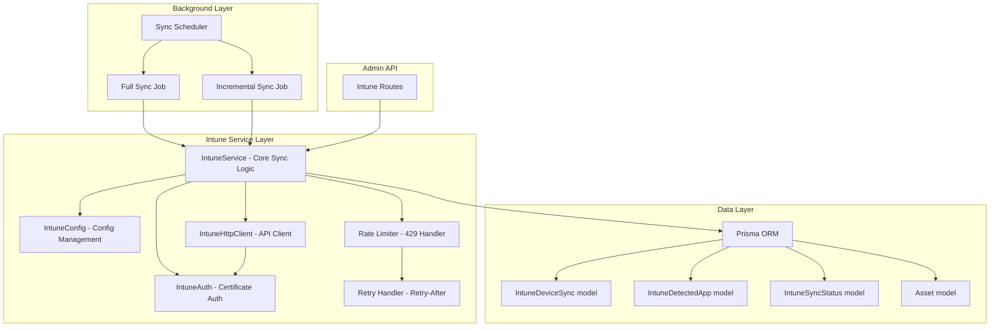
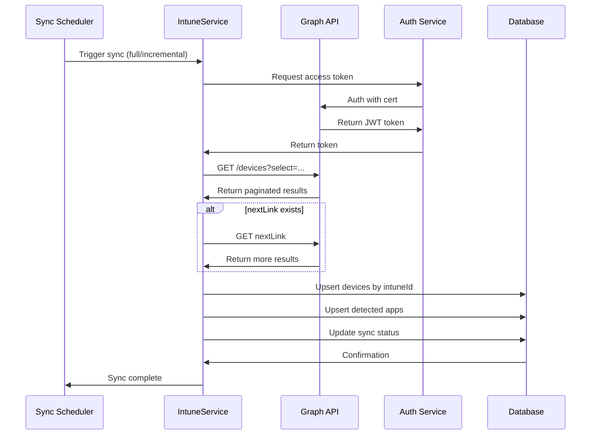
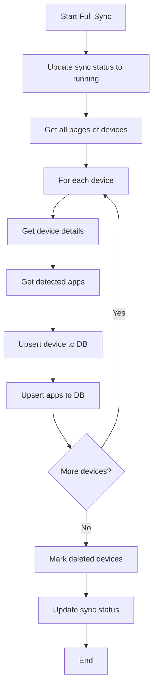
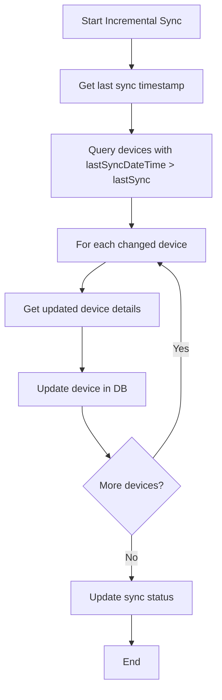

# Intune Integration Service - Technical Specification

## Overview

This document specifies the architecture for a Microsoft Intune integration service that synchronizes managed devices as assets into the Asset Management system. The service uses Microsoft Graph API v1.0 with certificate-based authentication against Microsoft Entra ID.

## Phase 7 Implementation Notes

- Authentication is implemented with `@azure/msal-node` confidential client certificate credentials and `.default` Graph scope.
- Certificate material is loaded via a testable SecretStore abstraction. Supported providers are `env:` and `file:`; no default secrets are provided.
- The only required Graph application permission is `DeviceManagementManagedDevices.Read.All`; health checks validate it with a real `managedDevices` probe.
- Managed device `$select` is limited to supported fields from `deviceManagement/managedDevices`, including `operatingSystem`, `managementAgent`, `complianceState`, `managementState`, `emailAddress`, `userDisplayName`, `userPrincipalName`, `azureADDeviceId`, `wiFiMacAddress` and `ethernetMacAddress`.
- Full sync uses the already fetched ID list for stale detection and never automatically archives linked assets.
- Asset matching/creation is idempotent and integrates `FieldLock` plus `FieldProvenance` through the Phase-2 import framework tables.
- Synchronization runs are historized through `ImportRun`; partial record failures produce `partial_success` in `IntuneSyncStatus`.

## Architecture Diagram



## Data Flow



## File Structure

```
backend/
├── src/
│   ├── services/
│   │   ├── intune.service.ts       # Main sync orchestration
│   │   ├── intune.auth.ts          # Certificate-based auth
│   │   ├── intune.config.ts        # Configuration management
│   │   └── intune.client.ts        # HTTP client with retry/rate-limit
│   ├── routes/
│   │   └── intune.routes.ts        # Admin routes for sync control
│   └── index.ts                    # Register background service
│
├── prisma/
│   └── schema.prisma               # Add Intune models
│
├── .env.example                     # Add Intune env vars
└── package.json                     # Add axios dependency
```

## 1. Prisma Schema Extensions

### IntuneDeviceSync Model
Tracks each device synced from Intune with all relevant fields.

```prisma
model IntuneDeviceSync {
  id                       String   @id @default(uuid())
  intuneId                 String   @unique                    // device id from Intune (GUID)
  name                     String?
  serialNumber             String?
  manufacturer             String?
  model                    String?
  osName                   String?
  osVersion                String?
  deviceEnrollmentType     String?
  managementType           String?
  complianceStatus         String?
  deviceState              String?
  enrollmentDateTime       DateTime?
  lastSyncDateTime         DateTime?
  primaryUserEmail         String?
  primaryUserDisplayName   String?
  endpointSecurityStatus   Json?
  malwareStatus            Json?
  compliancePolicyName     String?
  configurationPolicyName  String?
  autopilotStatus          String?
  autopilotProfileName     String?
  lastSeenDateTime         DateTime?
  intuneLicenseState       String?
  deviceWpdsStatus         String?
  syncStatus               String   @default("pending")        // pending, synced, error
  syncErrorMessage         String?
  syncAttempts             Int      @default(0)
  lastSyncAt               DateTime?
  assetId                  String?  @unique                    // linked asset in local DB
  sourceIntuneId           String?
  sourceUpdatedAt          DateTime?
  isArchived               Boolean  @default(false)
  createdAt                DateTime @default(now())
  updatedAt                DateTime @updatedAt

  @@index([intuneId])
  @@index([syncStatus])
  @@index([lastSyncDateTime])
  @@map("intune_device_syncs")
}
```

### IntuneDetectedApp Model
Tracks detected applications on synced devices.

```prisma
model IntuneDetectedApp {
  id                       String   @id @default(uuid())
  intuneAppId              String                        // app identity id from Intune
  deviceId                 String                        // FK to IntuneDeviceSync
  name                     String?
  version                  String?
  publisher                String?
  platform                 String?                        // ios, android, windows, macos
  appCategory              String?                       // enterprise, corporate, etc.
  isManaged                Boolean  @default(false)
  syncStatus               String   @default("pending")   // pending, synced, error
  syncErrorMessage         String?
  syncAttempts             Int      @default(0)
  lastSyncAt               DateTime?
  sourceIntuneId           String?
  sourceUpdatedAt          DateTime?
  isArchived               Boolean  @default(false)
  createdAt                DateTime @default(now())
  updatedAt                DateTime @updatedAt

  @@index([intuneAppId])
  @@index([deviceId])
  @@map("intune_detected_apps")
}
```

### IntuneSyncStatus Model
Tracks sync health and configuration.

```prisma
model IntuneSyncStatus {
  id                       String   @id @default(uuid())
  syncType                 String                        // full, incremental
  status                   String   @default("idle")    // idle, running, success, error
  deviceCount              Int      @default(0)
  deviceSynced             Int      @default(0)
  deviceErrors             Int      @default(0)
  appCount                 Int      @default(0)
  appSynced                Int      @default(0)
  appErrors                Int      @default(0)
  lastSyncStartedAt        DateTime?
  lastSyncCompletedAt      DateTime?
  lastSyncDurationMs       Int?
  lastError                String?
  totalSyncs               Int      @default(0)
  totalDevicesSynced       Int      @default(0)
  totalDevicesErrors       Int      @default(0)
  healthStatus             String   @default("healthy")  // healthy, degraded, unhealthy
  createdAt                DateTime @default(now())
  updatedAt                DateTime @updatedAt

  @@map("intune_sync_status")
}
```

### IntuneSyncConfig Model
Stores sync configuration state (can be in DB for persistence).

```prisma
model IntuneSyncConfig {
  id                       String   @id @default(uuid())
  enabled                  Boolean  @default(false)
  fullSyncIntervalHours    Int      @default(24)
  incrementalSyncIntervalMinutes Int @default(120)
  gracePeriodHours         Int      @default(168)        // 7 days before archiving
  maxRetryAttempts         Int      @default(3)
  retryDelayMs             Int      @default(5000)
  batchSize                Int      @default(100)
  lastFullSyncAt           DateTime?
  lastIncrementalSyncAt    DateTime?
  nextFullSyncAt           DateTime?
  nextIncrementalSyncAt    DateTime?
  createdAt                DateTime @default(now())
  updatedAt                DateTime @updatedAt

  @@map("intune_sync_config")
}
```

## 2. Authentication Service (`intune.auth.ts`)

### Certificate-Based Authentication Flow

1. Load PEM certificate from file path (configured via env var)
2. Extract public key thumbprint
3. Create JWT signed with RSA-SHA256 using the certificate
4. Exchange JWT for access token via Microsoft token endpoint
5. Cache token and refresh before expiry

### Key Design Decisions

- **No passwords in code** — all secrets via environment variables or file paths
- **Token caching** — in-memory cache with 55-minute TTL (token validity is 60 min)
- **Automatic token refresh** — refresh 5 minutes before expiry
- **Certificate loading** — supports both `.pem` and `.pfx` formats

### API Methods

```typescript
class IntuneAuthService {
  // Get valid access token (auto-refreshes if needed)
  getAccessToken(): Promise<string>

  // Refresh token cache
  refreshAccessToken(): Promise<string>

  // Get token expiry time
  getTokenExpiry(): Date

  // Check if token is valid
  isTokenValid(): boolean
}
```

## 3. Configuration Management (`intune.config.ts`)

### Environment Variables

| Variable | Description | Required |
|----------|-------------|----------|
| `INTUNE_ENABLED` | Enable/disable Intune sync | No |
| `INTUNE_TENANT_ID` | Microsoft Entra ID tenant ID | Yes |
| `INTUNE_APP_ID` | App (client) ID | Yes |
| `INTUNE_CERT_PATH` | Path to PEM certificate file | Yes |
| `INTUNE_CERT_THUMPRINT` | Certificate thumbprint (for token signing) | Yes |
| `INTUNE_APP_NAME` | Display name for devices | No (default: "Asset-Management") |
| `INTUNE_FULL_SYNC_INTERVAL` | Hours between full syncs (default: 24) | No |
| `INTUNE_INCREMENTAL_SYNC_INTERVAL` | Minutes between incremental syncs (default: 120) | No |
| `INTUNE_GRACE_PERIOD_HOURS` | Days before archiving deleted devices (default: 168) | No |
| `INTUNE_MAX_RETRY_ATTEMPTS` | Max API retry attempts (default: 3) | No |

### Config Loading

```typescript
class IntuneConfig {
  // Load from environment variables
  static fromEnv(): IntuneConfig

  // Check if service is enabled
  isEnabled(): boolean

  // Get sync interval settings
  getSyncIntervals(): SyncIntervals

  // Validate configuration
  validate(): ValidationResult
}
```

## 4. HTTP Client (`intune.client.ts`)

### Microsoft Graph API Endpoints Used

| Purpose | Endpoint |
|---------|----------|
| Devices list | `GET https://graph.microsoft.com/v1.0/deviceManagement/managedDevices` |
| Device detail | `GET https://graph.microsoft.com/v1.0/devices?$filter=deviceId eq '{intuneId}'` |
| Detected apps | `GET https://graph.microsoft.com/v1.0/deviceManagement/managedDevices/{deviceId}/detectedApps` |
| Device health | `GET https://graph.microsoft.com/v1.0/deviceManagement/managedDevices/{deviceId}/deviceHealth` |
| Compliance | `GET https://graph.microsoft.com/v1.0/deviceManagement/managedDevices/{deviceId}/compliancePolicyHistory` |

### Client Features

- **Automatic token injection** — calls `IntuneAuthService.getAccessToken()` before each request
- **Odata pagination** — follows `@odata.nextLink` automatically
- **Rate limiting** — handles HTTP 429 with `Retry-After` header
- **Retry logic** — configurable max retries with exponential backoff
- **Request timeout** — configurable per-request timeout
- **Logging** — structured logging for all API calls

### Pagination Strategy

```typescript
class IntuneHttpClient {
  // Get all pages of results for a query
  getAll<T>(url: string, params?: Record<string, string>): Promise<T[]>

  // Get single page
  getPage<T>(url: string, params?: Record<string, string>): Promise<{
    data: T[];
    nextLink?: string;
  }>

  // With rate limit handling
  getAllWithRateLimit<T>(url: string): Promise<T[]>
}
```

## 5. Sync Service (`intune.service.ts`)

### Sync Modes

| Mode | Description | Trigger |
|------|-------------|---------|
| Full Sync | Fetches all devices and apps from Intune | Scheduled (every 24h) |
| Incremental | Fetches only changed devices since last sync | Scheduled (every 2-4h) |

### Sync Flow (Full)



### Sync Flow (Incremental)



### Device Mapping Logic

```typescript
// Map Intune device fields to Asset model fields
interface IntuneDeviceToAssetMapping {
  // Map to assetTypeId (device type detection)
  getAssetType(intuneDevice: IntuneDevice): AssetType

  // Map to asset fields
  mapToDevice(intuneDevice: IntuneDevice): Partial<Asset>

  // Map primary user to user lookup
  mapToUser(intuneDevice: IntuneDevice): { ownerId?: string }

  // Determine lifecycle status from device state
  getLifecycleStatus(deviceState: string, complianceStatus: string): string
}
```

### Device State Mapping

| Intune deviceState | Asset lifecycleStatus | Asset status |
|---------------------|----------------------|--------------|
| active | active | active |
| enrolled | active | active |
| retired | archived | archived |
| disabled | planned | inactive |
| cleanupPending | planned | pending |

### Compliance Status Mapping

| Intune complianceStatus | Asset status |
|--------------------------|-------------|
| compliant | active |
| nonCompliant | warning |
| errorUnknown | warning |
| compliancePolicyConflict | warning |
| notApplicable | active |

### Deleted Device Handling

1. Mark device with `isArchived = true` and `syncStatus = 'deleted'`
2. Link to existing asset (if any) and mark asset as `archived`
3. Keep archive for configurable grace period (default: 7 days)
4. After grace period, mark as fully archived (but keep in DB for audit)

## 6. Background Sync Scheduler

### Implementation

Uses `setInterval` with dynamic intervals from config:

```typescript
class IntuneSyncScheduler {
  private fullSyncTimer: NodeJS.Timeout | null = null;
  private incrementalSyncTimer: NodeJS.Timeout | null = null;

  start(): void {
    // Start incremental sync timer
    this.incrementalSyncTimer = setInterval(
      () => this.runIncrementalSync(),
      config.incrementalSyncIntervalMs
    );

    // Start full sync timer
    this.fullSyncTimer = setInterval(
      () => this.runFullSync(),
      config.fullSyncIntervalMs
    );

    // Run initial sync immediately
    this.runFullSync();
  }

  stop(): void {
    if (this.fullSyncTimer) clearInterval(this.fullSyncTimer);
    if (this.incrementalSyncTimer) clearInterval(this.incrementalSyncTimer);
  }
}
```

### Integration with `index.ts`

```typescript
// In index.ts, after app starts:
import { intuneSyncScheduler } from './services/intune.scheduler';

// Start background services
if (intuneConfig.isEnabled()) {
  intuneSyncScheduler.start();
  console.log('Intune sync scheduler started');
}
```

## 7. Admin Routes (`intune.routes.ts`)

### Endpoints

| Method | Path | Description |
|--------|------|-------------|
| GET | `/api/v1/intune/status` | Get current sync status and health |
| GET | `/api/v1/intune/config` | Get current sync configuration |
| PUT | `/api/v1/intune/config` | Update sync configuration |
| POST | `/api/v1/intune/sync/full` | Trigger full sync manually |
| POST | `/api/v1/intune/sync/incremental` | Trigger incremental sync manually |
| GET | `/api/v1/intune/devices` | List synced devices (with pagination) |
| GET | `/api/v1/intune/devices/:id` | Get specific synced device details |
| GET | `/api/v1/intune/apps` | List detected apps |
| POST | `/api/v1/intune/devices/:id/resync` | Resync a specific device |
| DELETE | `/api/v1/intune/devices/:id/archive` | Archive a synced device |

### Route Implementation Pattern

Following existing patterns in `admin.routes.ts`:

```typescript
import { Router, Request, Response, NextFunction } from 'express';
import { authenticate, AuthRequest } from '../middleware/auth';
import { intuneSyncScheduler } from '../services/intune.scheduler';
import { intuneService } from '../services/intune.service';

export const intuneRouter = Router();

intuneRouter.get('/status', authenticate, async (req: AuthRequest, res, next) => {
  try {
    const status = await intuneService.getSyncStatus();
    res.json(status);
  } catch (error) {
    next(error);
  }
});

// ... other routes
```

## 8. Dependencies

### New npm packages to add to `backend/package.json`:

```json
{
  "dependencies": {
    "axios": "^1.6.0",
    "jsonwebtoken": "^9.0.2"
  }
}
```

Note: `jsonwebtoken` is already in dependencies. `axios` needs to be added.

## 9. Database Migration Strategy

### Migration Steps

1. Add new models to `schema.prisma`
2. Run `prisma migrate create --name add_intune_models`
3. Prisma generates migration SQL
4. Migration adds:
   - `intune_device_syncs` table
   - `intune_detected_apps` table
   - `intune_sync_status` table
   - `intune_sync_config` table
5. Seed `intune_sync_config` with default values
6. Seed `intune_sync_status` with initial idle state

### Seed Data

```typescript
// Default sync config
{
  id: 'intune-default-config',
  enabled: false,
  fullSyncIntervalHours: 24,
  incrementalSyncIntervalMinutes: 120,
  gracePeriodHours: 168,
  maxRetryAttempts: 3,
  retryDelayMs: 5000,
  batchSize: 100
}

// Default sync status
{
  id: 'intune-default-status',
  syncType: 'full',
  status: 'idle',
  deviceCount: 0,
  deviceSynced: 0,
  deviceErrors: 0,
  appCount: 0,
  appSynced: 0,
  appErrors: 0,
  healthStatus: 'healthy'
}
```

## 10. Error Handling Strategy

### Error Categories

| Category | HTTP Status | Handling |
|----------|-------------|----------|
| Auth failure (401) | 500 | Log error, set healthStatus to 'unhealthy', stop sync |
| Rate limit (429) | N/A | Respect Retry-After header, pause sync |
| Network timeout | 500 | Retry with exponential backoff |
| API error (4xx) | 4xx | Log specific error, continue with other devices |
| Database error | 500 | Log error, set syncStatus to 'error' |
| Invalid config | 400 | Return config validation error |

### Health Status Logic

```typescript
// Update health status based on recent sync results
function updateHealthStatus(): 'healthy' | 'degraded' | 'unhealthy' {
  const recentErrors = getRecentSyncErrors();
  if (recentErrors.authFailures > 0) return 'unhealthy';
  if (recentErrors.rateLimits > 5) return 'degraded';
  if (recentErrors.networkErrors > 10) return 'degraded';
  return 'healthy';
}
```

## 11. Security Considerations

1. **Certificate storage**: Certificate path stored in env var, certificate file outside repo
2. **No secrets in code**: All credentials via environment variables
3. **Token caching**: Access tokens cached in memory, never persisted
4. **Minimal permissions**: Uses `DeviceManagementManagedDevices.Read.All` (read-only)
5. **Audit logging**: All sync operations logged to `audit_logs` table
6. **Input validation**: All config values validated before use

## 12. Performance Considerations

1. **Batch operations**: Use Prisma's `createMany` for bulk inserts
2. **Connection pooling**: Reuse Prisma connection pool
3. **Pagination**: Handle large device lists via odata nextLink
4. **Concurrent requests**: Limit concurrent API calls to avoid rate limiting
5. **Memory management**: Process devices in batches, not all at once

## 13. Frontend Integration (Future)

The admin routes will support a future frontend section for:
- Viewing sync status and health
- Triggering manual syncs
- Viewing synced devices list
- Configuring sync settings
- Viewing sync error logs
