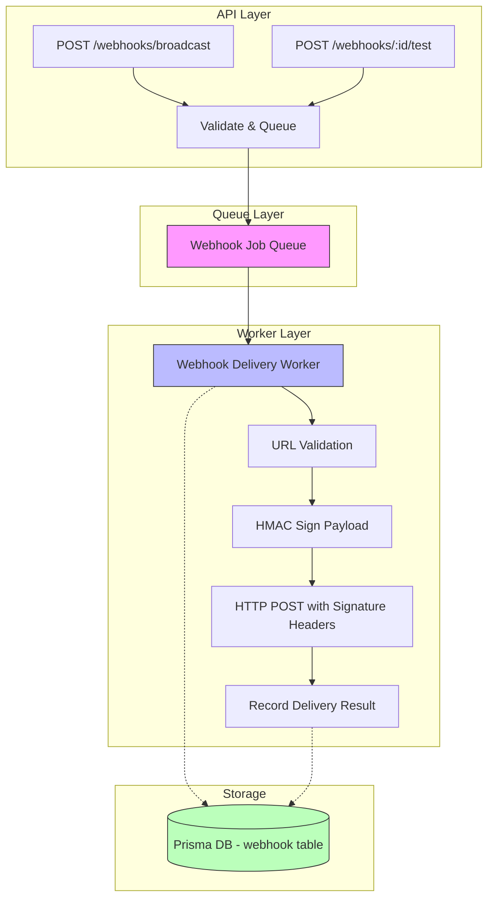
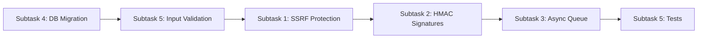

# Webhook Security Remediation Plan

## Summary

This plan addresses the following security vulnerabilities in the webhook system:

1. **SSRF via unrestricted webhook URLs** - Webhook targets can be set to any URL including localhost, private IPv4/IPv6, link-local, cloud metadata endpoints
2. **Missing HMAC signature on delivery** - `generateHmacSignature()` exists but `deliverWebhook()` never uses it
3. **Replay-vulnerable signature verification** - No max age check on timestamp
4. **In-memory storage** - Webhooks lost on restart, multiple instances have different state
5. **Unbounded retries/timeout** - `maxRetries` and `timeoutMs` not meaningfully limited
6. **Synchronous broadcast** - Runs in request path, blocks the API

---

## Architecture Overview



---

## Subtask 1: URL Validation and SSRF Protection

### Files to create/modify

| File | Action |
|------|--------|
| `backend/src/services/urlValidator.ts` | **Create** - SSRF protection utility |
| `backend/src/routes/webhook.routes.ts` | **Modify** - Add URL validation on create/update/test/broadcast |

### Implementation details

#### 1.1 Create `backend/src/services/urlValidator.ts`

This module provides comprehensive SSRF protection:

```typescript
// Core functions:
// - validateWebhookUrl(url: string): { valid: boolean; reason?: string }
// - isPrivateAddress(ip: string): boolean
// - blocksPrivateRange(addr: string): boolean
```

**Validation rules:**

1. **Protocol enforcement**: Only `https://` allowed. Reject `http://`, `file://`, `ftp://`, `javascript:`, `data:`, `blob:`
2. **DNS resolution check**: Resolve hostname to IP before saving. Reject if it resolves to:
   - `127.0.0.0/8` (loopback)
   - `10.0.0.0/8` (private)
   - `172.16.0.0/12` (private)
   - `192.168.0.0/16` (private)
   - `169.254.0.0/16` (link-local)
   - `::1` (IPv6 loopback)
   - `fc00::/7` (IPv6 unique local)
   - `fe80::/10` (IPv6 link-local)
   - `169.254.169.254` (AWS metadata)
   - `100.100.100.200` (Alibaba metadata)
   - `168.63.129.16` (Azure metadata)
   - `100.125.1.10` (GCP metadata)
3. **Redirect protection**: On HTTP redirect (3xx), validate the new URL too. Limit to 3 redirects max.
4. **DNS rebinding protection**: Resolve hostname at delivery time too, not just at save time. If the resolved IP changed to a private range since save, block delivery.
5. **Hostname validation**: Reject empty hostnames, non-ASCII characters in hostname, bare IPs as URLs.

#### 1.2 Modify webhook routes

Add validation at these points:
- `POST /webhooks` - validate URL on creation
- `PATCH /webhooks/:id` - validate URL when changed
- `POST /webhooks/:id/test` - validate URL at delivery time (re-resolve)

Return `400 Bad Request` with clear reason on validation failure.

---

## Subtask 2: HMAC Signature Generation and Verification

### Files to create/modify

| File | Action |
|------|--------|
| `backend/src/services/webhook.service.ts` | **Modify** - Add signature to delivery, add timestamp validation |
| `backend/src/services/urlValidator.ts` | **Create** - (see Subtask 1) |

### Implementation details

#### 2.1 Fix `generateHmacSignature()`

Current implementation (line 30-36 of [`webhook.service.ts`](backend/src/services/webhook.service.ts:30)):
```typescript
export function generateHmacSignature(secret: string, payload: WebhookPayload): string {
  const timestamp = Date.now();
  const message = `${timestamp}.${JSON.stringify(payload)}`;
  const hmac = crypto.createHmac('sha256', secret);
  hmac.update(message);
  return `t=${timestamp},s=${hmac.digest('hex')}`;
}
```

This is actually correct. The issue is it is never called during delivery.

#### 2.2 Modify `deliverWebhook()` to include signature headers

Add these headers to every webhook delivery:

```typescript
headers: {
  'Content-Type': 'application/json',
  'X-Webhook-Event': payload.type,
  'X-Webhook-Timestamp': String(timestamp),
  'X-Webhook-Signature': signature,  // NEW: HMAC signature
  'X-Webhook-Id': payload.id,        // NEW: event ID for idempotency
},
```

The signature is computed over `timestamp + body` where body is the JSON-serialized payload.

#### 2.3 Fix `verifyHmacSignature()` to enforce max age

Current implementation does not check if the timestamp is too old. Add:

```typescript
export function verifyHmacSignature(
  secret: string,
  payload: unknown,
  signature: string,
  maxAgeMs: number = 5 * 60 * 1000  // 5 minutes default
): boolean {
  // Parse timestamp from signature
  const timestampMatch = signature.match(/t=(\d+)/);
  if (!timestampMatch) return false;

  const signatureTimestamp = parseInt(timestampMatch[1], 10);
  const now = Date.now();

  // Replay attack protection: reject signatures older than maxAgeMs
  if (now - signatureTimestamp > maxAgeMs) {
    return false;
  }

  // ... existing HMAC verification logic
}
```

#### 2.4 Add `WEBHOOK_SIGNATURE_SECRET` environment variable

Add to `.env.example`:
```env
# Webhook signing secret (HMAC-SHA256). Generated on first start if not set.
WEBHOOK_SIGNATURE_SECRET=
```

If not set, generate a secure random secret on startup and log it once.

---

## Subtask 3: Move Webhook Delivery to Async Queue

### Files to create/modify

| File | Action |
|------|--------|
| `backend/src/services/webhookQueue.service.ts` | **Create** - Queue-based webhook delivery |
| `backend/src/services/webhook.service.ts` | **Modify** - Refactor delivery for queue integration |
| `backend/src/routes/webhook.routes.ts` | **Modify** - Queue instead of synchronous delivery |
| `backend/src/index.ts` | **Modify** - Initialize webhook queue on startup |

### Implementation details

#### 3.1 Leverage existing job infrastructure

The project already has a [`jobRunner.service.ts`](backend/src/services/jobRunner.service.ts) with DB-backed job tracking and distributed locking. We will extend this pattern for webhook delivery.

#### 3.2 Create `backend/src/services/webhookQueue.service.ts`

```typescript
// Core functions:
// - queueWebhookDelivery(webhookId: string, payload: WebhookPayload): Promise<void>
// - processWebhookJob(jobId: string, webhookId: string, payload: WebhookPayload): Promise<WebhookDeliveryResult>
// - startWebhookQueueWorker(): void
// - stopWebhookQueueWorker(): void
```

**Design:**

1. **Queue model**: Use the existing `JobRun` database table. Each webhook delivery creates a job with:
   - `jobId`: `webhook-delivery-{webhookId}-{eventId}`
   - `jobType`: `webhook`
   - `payload`: serialized WebhookPayload + webhookId
   - `status`: `pending`

2. **Worker**: A background interval checker polls for `pending` webhook jobs, acquires a lease via `acquireJobLease`, and processes them.

3. **Non-blocking API**:
   - `POST /webhooks/broadcast` - Creates job records for each matching webhook, returns immediately with job IDs
   - `POST /webhooks/:id/test` - Creates a single job record, returns immediately with job ID
   - New endpoint `GET /webhooks/deliveries/:jobId` - Check delivery status

4. **Retry with backoff**: Re-queue failed jobs with exponential backoff (1m, 5m, 15m, 1h, 4h). Max 10 attempts.

5. **Circuit breaker**: If a webhook fails 5 consecutive times, mark it as `paused` and stop queuing until an admin re-enables it.

#### 3.3 Modify routes for async behavior

```typescript
// BEFORE (synchronous broadcast):
router.post('/broadcast', ..., async (req, res) => {
  for (const webhook of matchingWebhooks) {
    const result = await deliverWebhookWithRetry(payload, {...});
    // ... updates webhook state synchronously
  }
  res.json({ data: results });
});

// AFTER (async queue):
router.post('/broadcast', ..., async (req, res) => {
  const jobIds = [];
  for (const webhook of matchingWebhooks) {
    const jobId = await queueWebhookDelivery(webhook.id, payload);
    jobIds.push({ webhookId: webhook.id, jobId });
  }
  res.status(202).json({ data: jobIds, message: 'Webhooks queued for delivery' });
});
```

#### 3.4 Initialize worker in `index.ts`

```typescript
// After DB connection:
const webhookWorker = initializeWebhookQueueWorker();
webhookWorker.start();

// On shutdown:
process.on('SIGTERM', async () => {
  await webhookWorker.stop();
  // ... existing cleanup
});
```

---

## Subtask 4: Webhook Persistence (Database Migration)

### Files to create/modify

| File | Action |
|------|--------|
| `backend/prisma/schema.prisma` | **Modify** - Add Webhook and WebhookDelivery models |
| `backend/prisma/migrations/` | **Create** - Migration file |
| `backend/src/routes/webhook.routes.ts` | **Modify** - Replace in-memory Map with Prisma queries |

### Implementation details

#### 4.1 Prisma schema additions

Add to [`backend/prisma/schema.prisma`](backend/prisma/schema.prisma):

```prisma
enum WebhookStatus {
  active
  paused
  archived
}

model Webhook {
  id                String      @id @default(uuid())
  displayId         String      @unique @default("")
  name              String
  description       String?
  url               String
  secret            String      // HMAC signing secret
  events            String[]    @db.Text
  status            WebhookStatus @default(active)
  isActive          Boolean     @default(true)
  isArchived        Boolean     @default(false)
  lastDeliveryStatus String?    // "success" | "failed"
  lastDeliveredAt   DateTime?
  failureCount      Int         @default(0)
  maxRetries        Int         @default(5)
  timeoutMs         Int         @default(10000)
  createdAt         DateTime    @default(now())
  updatedAt         DateTime    @updatedAt
  createdBy         String?
  updatedBy         String?

  deliveries        WebhookDelivery[]

  @@index([status, isActive])
  @@index([events])
  @@map("webhooks")
}

enum WebhookDeliveryStatus {
  pending
  delivering
  success
  failed
  expired
}

model WebhookDelivery {
  id            String             @id @default(uuid())
  webhookId     String
  eventId       String             @unique  // idempotency key
  eventType     String
  payload       String             @db.Text  // JSON
  signature     String?            // HMAC signature sent
  statusCode    Int?
  errorMessage  String?
  durationMs    Int?
  attemptNumber Int                @default(1)
  status        WebhookDeliveryStatus @default(pending)
  createdAt     DateTime           @default(now())
  updatedAt     DateTime           @updatedAt

  webhook       Webhook            @relation(fields: [webhookId], references: [id], onDelete: Cascade)

  @@index([webhookId, status])
  @@index([status])
  @@map("webhook_deliveries")
}
```

#### 4.2 Migration strategy

1. Create migration: `npx prisma migrate dev --name add_webhooks`
2. The migration will:
   - Create `webhooks` table with all fields
   - Create `webhook_deliveries` table
   - Add indexes for performance

#### 4.3 Replace in-memory operations

Update all route handlers to use Prisma:

| Operation | Before | After |
|-----------|--------|-------|
| List | `webhooks.values()` | `prisma.webhook.findMany()` |
| Get | `webhooks.get(id)` | `prisma.webhook.findUnique()` |
| Create | `webhooks.set(id, webhook)` | `prisma.webhook.create()` |
| Update | `webhook.updatedAt = new Date()` | `prisma.webhook.update()` |
| Delete | `webhook.isArchived = true` | `prisma.webhook.update({ where: { id }, data: { isArchived: true } })` |
| Find matching | `filter(w => w.events.includes(event))` | `prisma.webhook.findMany({ where: { events: { has: event }, isActive: true, isArchived: false } })` |

#### 4.4 Display ID migration

Add a `beforeCreate` hook or migration script to generate `displayId` values (e.g., `WHK-0001`) for existing records.

---

## Subtask 5: Input Validation and Bounds

### Files to create/modify

| File | Action |
|------|--------|
| `backend/src/routes/webhook.routes.ts` | **Modify** - Add input validation with bounds |

### Implementation details

#### 5.1 Bounds for maxRetries and timeoutMs

```typescript
// In route handlers:
const maxRetries = Math.min(Math.max(parseInt(body.maxRetries) || 5, 0), 10);
const timeoutMs = Math.min(Math.max(parseInt(body.timeoutMs) || 10000, 1000), 30000);
```

- `maxRetries`: 0-10 (default 5)
- `timeoutMs`: 1000-30000 (default 10000)

#### 5.2 Add Zod schema validation

Create `backend/src/dtos/webhook.dto.ts`:

```typescript
import { z } from 'zod';

export const createWebhookSchema = z.object({
  name: z.string().min(1).max(200),
  description: z.string().max(1000).optional(),
  url: z.string().url(),
  events: z.array(z.string()).max(50).optional().default([]),
  maxRetries: z.number().int().min(0).max(10).optional().default(5),
  timeoutMs: z.number().int().min(1000).max(30000).optional().default(10000),
});
```

Apply validation middleware to POST and PATCH routes.

---

## Environment Variables

Add to `.env.example`:

```env
# ==========================================
# Webhook Configuration
# ==========================================

# HMAC-SHA256 signing secret for webhook payloads.
# If not set, a secure random secret is generated on first startup
# and logged to the console. Store this value for persistence across restarts.
WEBHOOK_SIGNATURE_SECRET=

# Maximum allowed age for webhook signatures (milliseconds).
# Default: 300000 (5 minutes). Signatures older than this are rejected.
WEBHOOK_SIGNATURE_MAX_AGE_MS=300000

# Webhook queue polling interval in milliseconds.
# Default: 5000 (5 seconds).
WEBHOOK_QUEUE_POLL_INTERVAL_MS=5000
```

---

## New Endpoints

| Method | Path | Description |
|--------|------|-------------|
| GET | `/api/v1/webhooks/deliveries/:deliveryId` | Get delivery status and details |
| GET | `/api/v1/webhooks/deliveries?webhookId=...&status=...` | List deliveries with filtering |
| POST | `/api/v1/webhooks/:id/regenerate-secret` | Regenerate the HMAC secret |

---

## File Changes Summary

| File | Change |
|------|--------|
| `backend/src/services/urlValidator.ts` | **NEW** - SSRF protection |
| `backend/src/services/webhookQueue.service.ts` | **NEW** - Queue worker |
| `backend/src/services/webhook.service.ts` | **MODIFY** - Sign payloads, fix verify |
| `backend/src/dtos/webhook.dto.ts` | **NEW** - Zod validation |
| `backend/src/routes/webhook.routes.ts` | **MODIFY** - DB persistence, validation, async |
| `backend/prisma/schema.prisma` | **MODIFY** - Add Webhook + WebhookDelivery models |
| `backend/.env.example` | **MODIFY** - Add webhook config |
| `backend/src/index.ts` | **MODIFY** - Initialize queue worker |
| `backend/src/__tests__/webhook.security.test.ts` | **NEW** - Security tests |

---

## Test Plan

### Security tests (new file: `backend/src/__tests__/webhook.security.test.ts`)

1. **SSRF protection tests**:
   - Reject `http://localhost:8080/webhook`
   - Reject `https://127.0.0.1/webhook`
   - Reject `https://10.0.0.1/webhook`
   - Reject `https://169.254.169.254/latest/meta-data/`
   - Reject `https://172.16.0.1/webhook`
   - Reject `https://192.168.1.1/webhook`
   - Reject `https://[::1]/webhook`
   - Accept `https://example.com/webhook`
   - Accept `https://hooks.mycompany.com/webhook`

2. **HMAC signature tests**:
   - Signature is included in delivery headers
   - Receiver can verify signature correctly
   - Tampered payload is detected
   - Old signatures (> 5 min) are rejected
   - Replay attacks are prevented

3. **Queue tests**:
   - Broadcast returns 202 immediately
   - Jobs are created in DB
   - Worker processes jobs asynchronously
   - Failed jobs are retried with backoff
   - Circuit breaker pauses after 5 failures

4. **Persistence tests**:
   - Webhooks survive server restart
   - Multiple instances share same webhook state
   - Display IDs are generated correctly

---

## Implementation Order



1. **DB Migration first** - All other changes depend on persistent storage
2. **Input validation** - Protect against invalid bounds before SSRF checks
3. **SSRF protection** - Secure the URL before any delivery happens
4. **HMAC signatures** - Add cryptographic integrity once delivery is secure
5. **Async queue** - Final step to decouple delivery from API

---

## Risk Assessment

| Risk | Mitigation |
|------|------------|
| Migration breaks existing data | Migration is additive; in-memory Map still works during transition |
| Queue worker fails silently | Uses existing JobRun table for observability |
| DNS rebinding race condition | Double-resolution: at save time AND at delivery time |
| Secret exposure in logs | Secret never logged; only the initial generation message includes it |
| Queue backlog under load | Circuit breaker pauses failing webhooks; max 10 retries with backoff |
